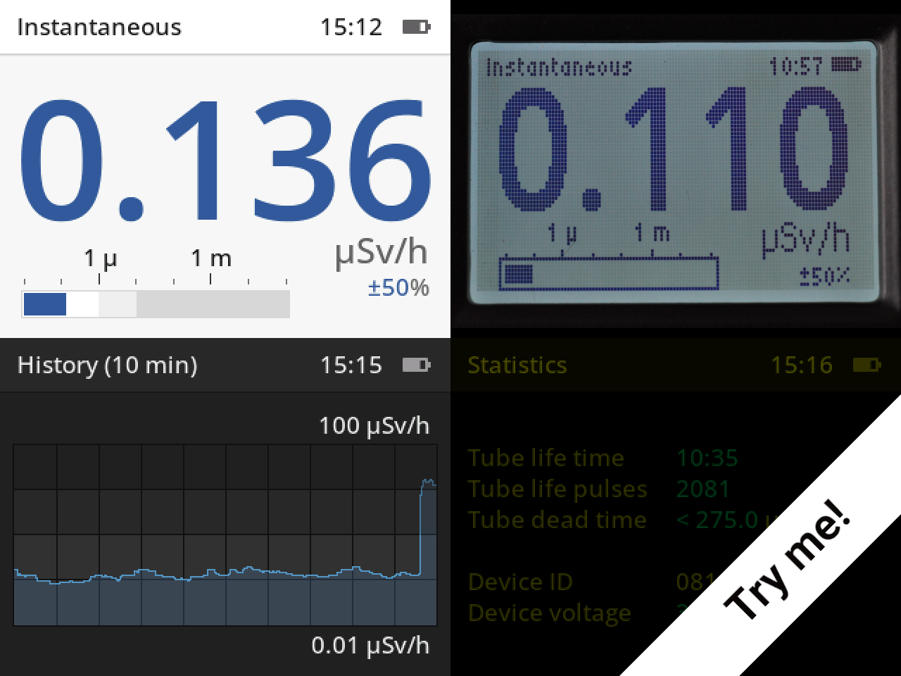

Try the [Rad Pro simulator](https://gissio.github.io/radpro-simulator/)!

## Introduction

Rad Pro is an advanced custom firmware designed to enhance the functionality of various commercially available Geiger counters, including the [FS2011](https://www.amazon.com/s?k=fs2011), [YT-203B](https://www.amazon.com/s?k=yt203b), [Bosean FS-600](https://bosean.net/products/nuclear_radiation_detector.html), [Bosean FS-1000](https://bosean.net/products/FS-1000_nuclear_radiation_detector.html), [Bosean FS-5000](https://bosean.net/FS-5000-Nuclear-Radiation-Detector-2.html), [FNIRSI GC-01](https://www.fnirsi.com/products/gc-01) and [JOY-IT JT-RAD01](https://joy-it.net/products/JT-RAD01).

With Rad Pro, you can:

* Monitor instantaneous radiation levels in real-time.
* Calculate average radiation rates for precise surveys.
* Track cumulative radiation dose over time.
* Configure customizable rate and dose alerts (warnings and alarms).
* Visualize radiation rate trends with historical plots (10 minutes, 1 hour, 1 day, 1 month, 1 year).
* Log data to built-in flash memory or stream live to a computer, with optional integration to [gmcmap.com](https://gmcmap.com), [radmon.org](https://radmon.org), and [safecast.org](https://map.safecast.org).
* Generate cryptographically secure random data, including passwords (ASCII, alphanumeric), random numbers (hexadecimal, decimal, binary), and virtual dice rolls (4, 6, 8, 10, 12, 20, and 100-sided) or coin flips.

## Installation guide

* [Important legal information](docs/legal.md)
* [FS2011/YT-203B installation guide](docs/devices/FS2011/install.md)
* [Bosean FS-600/Bosean FS-1000 installation guide](docs/devices/Bosean%20FS-600,%20FS-1000/install.md)
* [Bosean FS-5000 installation guide](docs/devices/Bosean%20FS-5000/install.md)
* [FNIRSI GC-01/JOY-IT JT-RAD01 installation guide](docs/devices/FNIRSI%20GC-01/install.md)
* [GQ GMC-800 installation guide](docs/devices/GQ%20GMC-800/install.md)

## Documentation

* [Rad Pro user's manual](docs/manual.md) – Comprehensive guide to using Rad Pro.
* [Ionizing radiation field guide](https://github.com/Gissio/ionizing-radiation-field-guide) – Learn the fundamentals of ionizing radiation.
* [Rad Pro developers's manual](docs/developers.md) – Technical details for developers.

## Tools & software

* [GeigerLog](https://sourceforge.net/projects/geigerlog/) – Data analysis software for PC.
* [RadPro Log Viewer](https://github.com/mayrthom/RadPro-LogViewer) – Data analysis app for Android.

## Acknowledgements

* Rad Pro's user interface leverages the industry-standard [OpenBridge 5.0](https://www.openbridge.no/) design system.
* Special thanks to `Alfred90`, `danielhahn76`, `felixsteghofer`, `DG0MG`, `murkle`, `cromagn`, `ivohar`,`mryndzionek`, `JantarX`,  `mizsha`, `Tig3rch3n`, `Arparela`, `w01fdev`, `martin-machacek`, `dsl71`, `Davegsm82`, `alfmck`, `jonwhite227`, `dc1rdb`, `ihrapsa`, `Montecri`, `boromix`, `maxobe`, `TheAsgard`, `ugopapetti`, `NuclearPhoenixx`, `technils`, `Ilja-code-art`, `ICantMakeThings`, `mayrthom`, `hackra76`, `plamenbe`, and many others for their invaluable testing and feedback.
* Special thanks to `pixitha` for FS2011 (GD32F150) board photos with a J305 Geiger tube, `felixsteghofer` for FS2011 (GD32F103) board photos, `DG0MG` for Bosean FS-600 board photos, `murkle` for Bosean FS-1000 board photos, `ivohar` for FNIRSCI GC-01 schematics, and `oOblik` for Bosean FS-5000 board photos.
