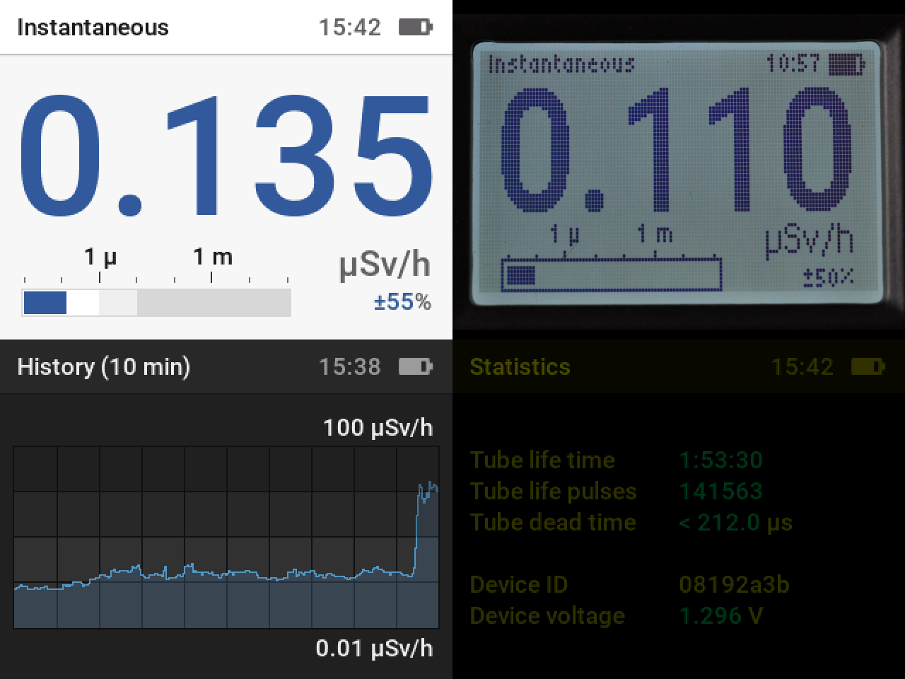
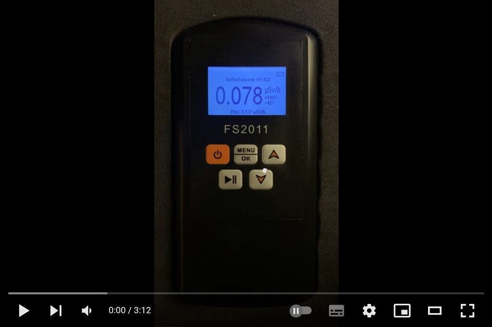

<!--  -->

## IMPORTANT

RAD PRO 2.0 IS NOT YET READY. The files in the releases are only for the FS2011 (STM32F051). Do not install these files on other devices.

## Introduction

Rad Pro is a custom firmware that enhances the capabilities of several commercially available Geiger counters, including the [FS2011](https://www.amazon.com/s?k=fs2011), [NR-950](https://www.amazon.com/s?k=nr950), [YT-203B](https://www.amazon.com/s?k=yt-203b), [Bosean FS-600](https://www.bosean.net/products/nuclear_radiation_detector.html), [Bosean FS-1000](https://www.bosean.net/products/FS-1000_nuclear_radiation_detector.html) and [FNIRSI GC-01](https://www.fnirsi.com.cn/product/704376090398953472).

Support for other devices, including the [Bosean FS-5000](https://www.bosean.net/FS-5000-Nuclear-Radiation-Detector.html), [GQ GMC-500](https://www.gqelectronicsllc.com/comersus/store/comersus_viewItem.asp?idProduct=5629), [GQ GMC-600](https://www.gqelectronicsllc.com/comersus/store/comersus_viewItem.asp?idProduct=5637) and [GQ GMC-800](https://www.gqelectronicsllc.com/comersus/store/comersus_viewItem.asp?idProduct=5859) is planned.

With Rad Pro, you can:

* Measure instantaneous radiation rate.
* Measure average radiation rate for performing surveys.
* Measure cumulative dose.
* Set up user-adjustable rate and dose alarms.
* Plot radiation rate history (10 minutes, 1 hour and 24 hours).
* Log data to the built-in flash memory or live on a computer, optionally sending the data to the [gmcmap.com](https://gmcmap.com), [radmon.org](https://radmon.org) and [safecast.org](https://map.safecast.org) radiation monitoring websites.
* Generate true random data: secure passwords (alphanumeric, full ASCII), random hexadecimal and decimal numbers, dice throws (4-sided, 6-sided, 8-sided, 12-sided and 20-sided) and coin flips.

## Updates

Rad Pro 2.0 adds:

* Support for the FNIRSI GC-01, Bosean FS-600, Bosean FS-1000, FS2011 with GD32F150 processor and FS2011 with GD32F103 processor.
* Instantaneous rate measurement with adaptive averaging window.
* Average rate measurement timer for performing surveys.
* Data logging with data compression.
* Serial port/USB communications.
* `radpro-tool` for downloading the data log, logging live data, submitting data to radiation monitoring websites and syncing the device clock.
* Dead-time measurement.
* Configurable dead-time compensation.
* Configurable high voltage generator frequency and duty cycle for tube voltage control.
* [safecast.org](https://map.safecast.org) radiation monitoring website submission.
* Redesigned user interface with the [OpenBridge 4.0](https://www.openbridge.no/) design system.
* Anti-aliased text rendering on color screens.
* Several bugfixes and optimizations.

Note: Rad Pro 2.0 uses a new settings format and requires an installation.

## Project overview

* [Legal stuff](docs/legal.md)

Installation:

* [Rad Pro simulator](docs/install-simulator.md)
* [FS2011/NR950/YT-203B](docs/devices/FS2011/install.md)
* [Bosean FS-600/Bosean FS-1000](docs/devices/Bosean%20FS-600,%20FS-1000/install.md)
* [FNIRSI GC-01](docs/devices/FNIRSI%20GC-01/install.md)
* [Other devices](docs/install-other.md)

Manuals:

* [User's manual](docs/manual.md)
* [Developers's manual](docs/developers.md)

## Acknowledgements

* Rad Pro's user interface is based on the [OpenBridge 4.0](https://www.openbridge.no/) design system.
* Thanks to `Alfred90`, `danielhahn76`, `felixsteghofer`, `DG0MG`, `murkle`, `cromagn`, `ivohar` and `mryndzionek` for device testing.
* Thanks to `pixitha` for the FS2011/GD32F150 board photo with a J305 Geiger tube, `felixsteghofer` for the FS2011/STM32F103 board photo, `DG0MG` for the Bosean FS-600 board photo, `murkle` for the Bosean FS-1000 board photo, and `ivohar` for the FNIRSCI GC-01 schematics.
