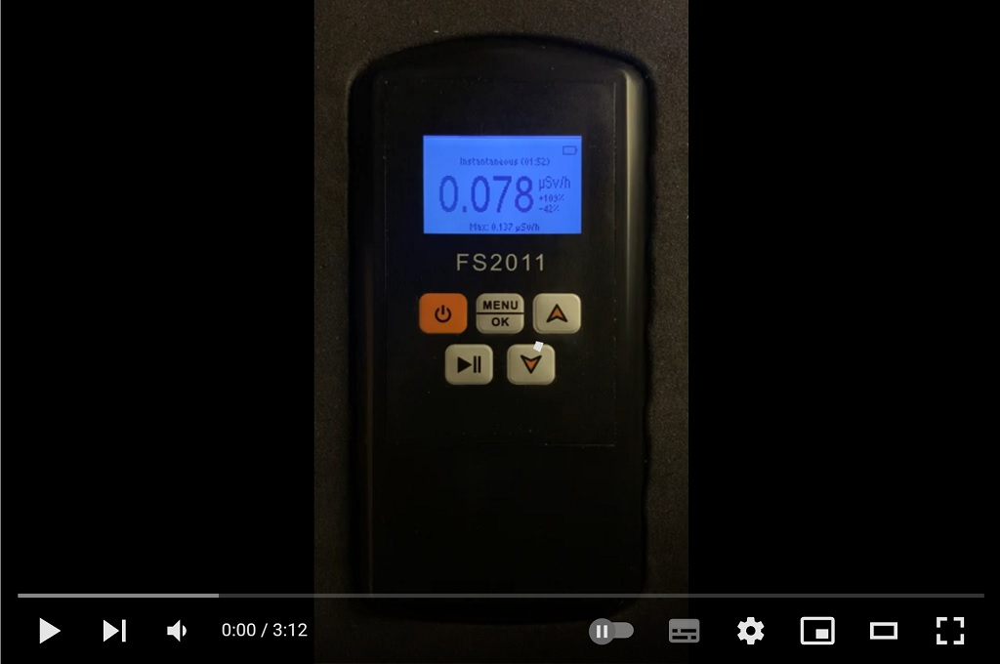
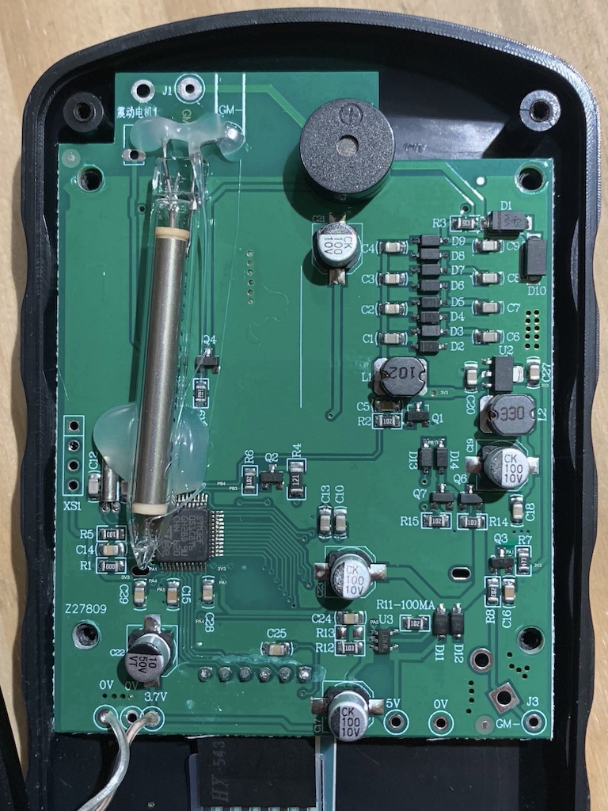

## Overview

FS2011 Pro is an advanced firmware that enhances the capabilities of the FS2011/FS2011+ radiation detector/Geiger counter.

Watch a demonstration of FS2011 Pro in action:

[](https://www.youtube.com/watch?v=7dpVG1jSLn8)

## Features

* Instantaneous rate, average rate, dose, and history modes.
* Intuitive user interface for easy navigation.
* Measurements in Sievert, rem, cpm and cps.
* Multiple history periods, including 2-minute, 10-minute, 1-hour, 6-hour and 24-hour options.
* 95% confidence intervals to ensure accurate readings.
* Measurement hold for instantaneous rate, average rate, and dose.
* Overload alert to prevent damage to the device.
* Customizable rate and dose alarms for personalized use.
* Password generator with true RNG.
* Nuclear chess.
* Configurable pulse click sounds: off, quiet, loud.
* Configurable backlight timer: off, on for 10 seconds, on for 60 seconds, or always on.
* Configurable battery type for battery level monitoring.
* Configurable Geiger-Müller tube: HH614 (48 mm long), M4011 (105 mm long), SBM-20 (108 mm long), SI-3BG (50 mm long).
* Device life statistics for monitoring usage.
* 40% more battery life compared to the original firmware.
* Power-on self-test and safety watchdog.

## Installation

Before installing FS2011 Pro, please read the following important information:

__Disclaimer:__ The authors of this software are not responsible or liable for any claims, damages, losses, expenses, costs, or liabilities whatsoever resulting or arising directly or indirectly from the use of this software.

__Notice:__ Please be aware that installing this software will void the warranty of your device.

By proceeding with the installation, you acknowledge that you have read and understood these terms and accept full responsibility for any consequences that may result from using this software. If you do not agree with these terms, do not install this software.

### Requirements

To install FS2011 Pro, you will need the following tools and components:

* A Philips screwdriver
* A soldering iron and solder
* A 4-pin header
* An ST-Link V2 USB dongle (or clone)
* [stlink][stlink-link]

### Instructions

Follow these steps to install FS2011 Pro firmware on your FS2011/FS2011+ radiation detector/Geiger counter:

* Remove the battery cover and batteries.
* Unscrew and remove the four screws holding the back case.
* Remove the four screws holding the electronics board on the front case.
* Remove the electronics board and ensure that it matches the board shown in the following picture (the Geiger-Müller tube may be different or mounted differently):



If your board looks different, you may have a different hardware version and this firmware may not work correctly.

* Solder the 4-pin header to XS1 on the board.
* Optionally, align the Geiger-Müller tube to the holes of the back case using a heat gun/glue gun if the tube is mounted vertically. Be careful, as the tube's glass is very delicate.
* Optionally, apply solder on the battery holder's pads so that low-profile AA batteries make good electrical contact.
* Optionally, increase the volume by drilling a hole on the back case in front of the buzzer.
* Optionall, add a female USB port and connect GND and +5V to the 0V and 5V pads of the electronics board. This modification will allow your FS2011 to run continuously and even charge Ni-MH batteries.
* Connect the ST-Link V2 device to XS1. The pins, from top to bottom, are:
  * GND
  * SWCLK
  * SWDIO
  * +3V3
* Before installing FS2011 Pro for the first time, back up the original firmware. If you skip this step, you won't be able to restore your device if something goes wrong. To create a backup, open a terminal and go to the `bin` folder within the stlink folder. Then, execute the following command and verify that the resulting file, `backup.bin`, has a size of 65536 bytes:

  ```
  st-flash read backup.bin 0x08000000 0x10000
  ```
* Download the latest FS2011 Pro firmware from the [releases][releases-link]: use the "-install" version when installing for the first time and the "-update" version when updating.
* To install FS2011 Pro, open a terminal, go to the `bin` folder within the stlink folder, and run this command:

  ```
  st-flash write [Firmware filename] 0x08000000
  ```

## Usage

To use this firmware, follow these instructions:

* To turn the device on and off, long-press the POWER key.
* To turn the backlight on (if the backlight is enabled), short-press the POWER key.

* To change the mode/selection, press the UP and DOWN keys.

* To hold/unhold the current measurement (in instantaneous rate, average rate, and dose mode), short-press the PLAY/PAUSE key.
* To reset the mode's measurements, long-press the PLAY/PAUSE key.

* To enter the menu/select a menu option, press the MENU/OK key. To go back from a menu/menu option, press the PLAY/PAUSE key.

## Measurement

The software measures the radiation in the following modes:

### Instantaneous rate

The instantaneous rate is calculated as the average between a first pulse and the most recent pulse. If there are more than 11 pulses in 5 seconds, the first pulse is the first one to occur within the 5-second window. Otherwise, it is the first of the most recent 11 pulses.

The 95% confidence intervals assume a constant level of radiation over the averaging period.

### Average rate

The average rate is calculated as the pulse average between the first and last pulse in the time window.

The 95% confidence intervals assume a constant level of radiation over the averaging period.

### Dose

The dose is calculated from the number of pulses in the time window.

### History

The history is calculated from the instantaneous rate, sampled once per second.

## Building

To start building the software, you'll need to install these tools: [Visual Studio Code][vscode-link] and the [platform.io][pio-link] extension. Once installed, open the platform.io folder to begin building.

Once you've built the firmware, you'll need to sign the resulting binary using Python and the `tools/sign.py` script.

## Thanks

* Special thanks to the u8g2 team.
* Special thanks to Alfred90 for device testing.

[stlink-link]: https://github.com/stlink-org/stlink/releases
[releases-link]: https://github.com/Gissio/fs2011pro/releases
[vscode-link]: https://code.visualstudio.com/
[pio-link]: https://platform.io/
