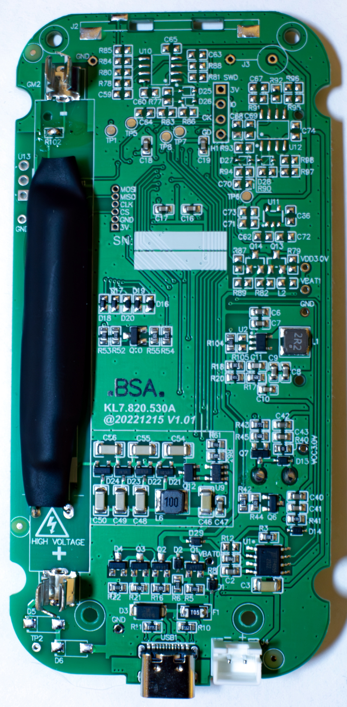
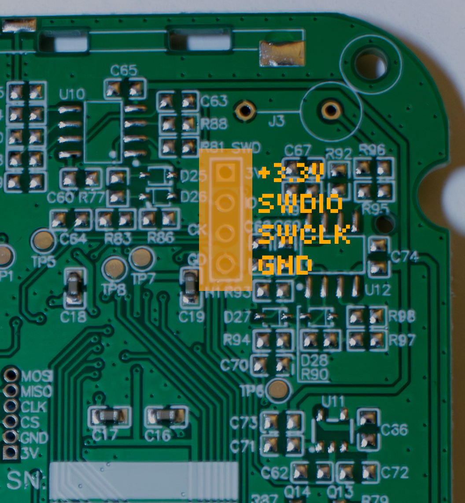

# Installing Rad Pro on Bosean FS-5000 Geiger counters

This guide explains how to install the Rad Pro firmware on Bosean FS-5000 Geiger counters.

To update the firmware, use the [Rad Pro web installer](https://gissio.github.io/radpro-installer/).

## What you'll need

* **ST-LINK V2 USB dongle** (or compatible clone): Available on [Amazon](https://www.amazon.com/s?k=st-link+v2).
* **4-pin header** for SWD connection.
* **Philips screwdriver** to open the device.
* **Optional:** Soldering iron and solder for a secure connection.
* **Windows users:** [ST-LINK driver](https://www.st.com/en/development-tools/stsw-link009.html)

## Step 1: Open the device

1. Power off the device.
2. Unscrew the back case and carefully open the device.
3. Confirm the circuit board matches the image above (Geiger-Müller tube may vary). If it differs, you may have a different hardware revision, and Rad Pro may not work correctly. Report issues on the [Rad Pro GitHub issues page](https://github.com/Gissio/radpro/issues).
4. Identify the Geiger-Müller tube (marked on the glass as J305, J321, J613, J614, or M4011). For unmarked tubes:
   * 55 mm tubes: Assume J614.
   * 65 mm tubes: Assume J613.

## Step 2: Connect the programmer

1. Optional: Solder a 4-pin header to the SWD pads on the board for a reliable connection.
2. Connect the ST-LINK V2 to the SWD pads using this pin configuration (top to bottom):
  * 3.3V
  * SWDIO
  * SWCLK
  * GND

**WARNING:** Double-check connections to avoid damaging the device.

## Step 3: Flash the firmware

1. Windows users: install the [ST-LINK driver](https://www.st.com/en/development-tools/stsw-link009.html).
2. Download and extract the latest `radpro-flashtool-[version].zip` from [Rad Pro releases](https://github.com/Gissio/radpro/releases).
3. Navigate to the `bosean-fs5000` folder and run the appropriate script:
  * Windows: Double click `install.bat`.
  * Linux: Run `install.sh` in a terminal.
  * macOS: Open `Terminal.app` (in `/Applications/Utilities`), navigate to the `bosean-fs5000` folder, and drag `install.sh` onto the Terminal icon in the dock.
4. Select a language by entering its two-letter code (e.g., `en` for English) when prompted.
5. The installer automatically backs up the original firmware to the `backup` folder. Store this file securely to restore the original firmware if needed.
   * To restore, drag the backup file onto `install.bat` (Windows) or `install.sh` (macOS/Linux).
6. Reassemble the device after flashing.

<!-- Note: check this [video](https://youtu.be/Ney8Cb1XnZk) for alternative installation instructions. -->

## Step 4: Configure the device

Use the following controls to operate your device:

  * **Power on/off:** Press and long hold the OK/Power key.
  * **Switch measurement mode:** Use the Up/Back or Down/Settings key.
  * **Switch secondary measurement view:** Press the OK/Power key.
  * **Reset measurement/dismiss alarm:** Press and long hold the Up/Back key.
  * **Toggle pulse sound (measurement view only):** Press and long hold both the Up/Back and Down/Settings key.
  * **Access settings:** Press and short hold the Down/Settings key.
  * **Navigate options:** Use the Up/Back or Down/Settings key.
  * **Select option:** Press and short hold the Right/Settings key or press the OK/Power key.
  * **Go back:** Press and short hold the Up/Back key.
  * **Toggle lock mode:** Press and long hold both the Up/Back and OK/Power keys.

To configure the device:

1. Go to **Settings > Geiger tube > Sensitivity** and select the option that matches your Geiger-Müller tube.
2. For USB data connections on Windows, install the [CH340 driver](https://www.catalog.update.microsoft.com/Search.aspx?q=USB%5CVID_1A86%26PID_7523).

For detailed usage, see the [Rad Pro User Manual](../../manual.md) and the [ionizing radiation field guide](https://github.com/Gissio/ionizing-radiation-field-guide).

## Step 5: Support Rad Pro

If you find Rad Pro useful:

* Watch the [Rad Pro GitHub repository](https://github.com/Gissio/radpro) for release updates.
* Star the project to show your support.

## Hardware-specific notes

<!-- Calculated as follows:

* With 1-byte differential values: [95 pages * (1 timestamp entry/page [16 bytes] + 2024 differential entries/page [1 byte each])] = 192375 entries
* With 2-byte differential values: [95 pages * (1 timestamp entry/page [16 bytes] + 1012 differential entries/page [2 byte each])] = 96235 entries

* 60-minute and 10-minute intervals require 2-byte differential values.
* 1-minute intervals and less require 1-byte differential values.

 -->

* **Data storage:** Stores up to 196,425 data points. At 20 cpm (normal radiation levels), this supports:
  * 4010 days at 60-minute intervals
  * 668 days at 10-minute intervals
  * 133 days at 1-minute intervals
  * 22 days at 10-second intervals
  * 53 hours at 1-second intervals

* **HV profiles:** Not supported.
