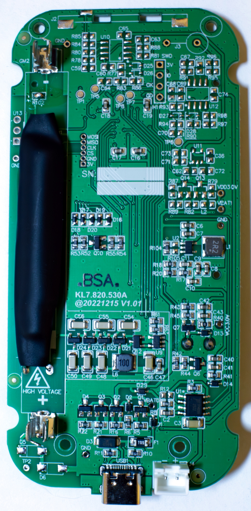
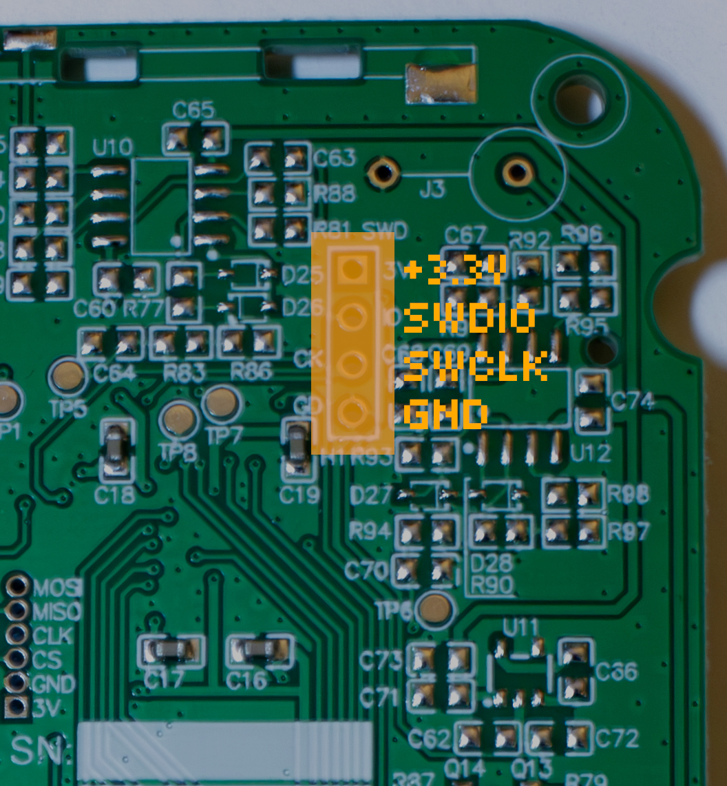
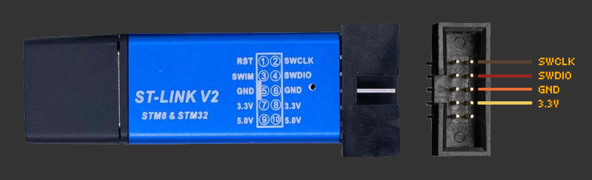

# Installing Rad Pro on the Bosean FS-5000

This guide explains how to install **Rad Pro** on Bosean FS-5000 Geiger counters.

If Rad Pro is already installed on your device, you can upgrade using the [Rad Pro web installer](https://gissio.github.io/radpro-installer/).

## What You'll Need

Make sure you have:

* An **ST-LINK V2 programmer** (or compatible clone)
* A **4-pin header** or jumper wires (for SWD connection)
* A **Phillips screwdriver**
* A **computer** (Windows, Linux, or macOS)

Optional:

* Soldering iron + solder

Windows only:

* Install the ST-LINK driver:
  [https://www.st.com/en/development-tools/stsw-link009.html](https://www.st.com/en/development-tools/stsw-link009.html)

## Step 1: Download the Firmware

1. Go to the Rad Pro releases page: https://github.com/Gissio/radpro/releases
2. Download the latest `radpro-[version].zip`.
3. Extract it on your computer.

## Step 2: Identify the Hardware

To select the correct settings, you'll need to identify the Geiger tube inside the device.

### Open the Device

1. Power off the device.
2. Unscrew the back case.
3. Carefully open the enclosure.

### Identify the Geiger Tube

Look for markings on the tube:

* **J305**, **J321**, **J613**, **HH614**, or **M4011**

If the tube is unmarked:

* ~55 mm or ~65 mm → assume **HH614**

## Step 3: Connect the ST-LINK Programmer

Locate the **SWD pads** on the board.

### Wiring (top to bottom)

Connect the ST-LINK as follows:

* 3.3V → 3.3V
* SWDIO → SWDIO
* SWCLK → SWCLK
* GND → GND

### Tips

* For a reliable connection, solder a 4-pin header to SWD

⚠️ Double-check all connections before powering anything. Incorrect wiring can damage the device.

## Step 4: Flash Rad Pro

1. Open the extracted firmware folder: `bosean-fs5000/`
2. Run the Installer:
   * **Windows:** double-click `install.bat`
   * **Linux:** run `./install.sh` in a terminal
   * **macOS:** open Terminal and run `install.sh`
3. When prompted, enter your preferred language (e.g., `en`, `es`)

The original firmware is automatically **backed up** into the `backup/` folder

Rad Pro is flashed to the device.

> Keep the backup file safe—you'll need it to restore the original firmware.

### Restoring Original Firmware

* **Windows:** drag the backup file onto `install.bat`
* **Linux/macOS:** pass the backup file to `install.sh`

## Step 5: Reassemble the Device

* Disconnect the ST-LINK
* Reassemble the device

<!-- Note: check this [video](https://youtu.be/Ney8Cb1XnZk) for alternative installation instructions. -->

## Step 6: Basic Controls

Once installed, here are the essential controls:

### Navigation

* **Press Up / Down:** Change measurement mode / navigate menus
* **Short Hold Down:** Select / open settings
* **Short Hold Up:** Go back

### System

* **Long Hold OK:** Power on/off
* **Long Hold Up + OK:** Toggle lock mode

### Measurement Screen

* **Short Hold Up:** Switch secondary display
* **Long Hold Up:** Reset measurement / dismiss alerts
* **Long Hold Up + Down:** Toggle pulse sound

### Random generator

* **Short Hold Down:** Restart random generator

## Step 7: First Configuration

* Open **Settings > Geiger tube > Tube type**.
* Select the tube you identified earlier.

## Step 8: Finish Up

* 📖 **Read the documentation**:
  * [Rad Pro user's manual](../../users-manual.md) – Easy guide to using Rad Pro
  * [Rad Pro reference manual](../../reference-manual.md) – Technical reference for Rad Pro
  * [Ionizing radiation field guide](https://github.com/Gissio/ionizing-radiation-field-guide) – Learn about ionizing radiation
* ⭐ **Support the project** by starring the repository: [https://github.com/Gissio/radpro](https://github.com/Gissio/radpro)
* 👥 **Help us grow** — share Rad Pro on social networks, forums, or with fellow enthusiasts!

## Hardware Notes

<!-- Calculated as follows:

* With 1-byte differential values: [101 pages * (1 timestamp record/page [16 bytes] + 2032 differential records/page [1 byte each])] = 205333 records
* With 2-byte differential values: [101 pages * (1 timestamp record/page [16 bytes] + 1016 differential records/page [2 byte each])] = 102717 records

* 60-minute and 10-minute intervals require 2-byte differential values.
* 1-minute intervals and less require 1-byte differential values.

 -->

### Data Storage Capacity

Rad Pro stores up to **205,333 measurements**.

At typical background radiation (~20 CPM), this corresponds to:

* **60-minute interval:** ~4279 days
* **10-minute interval:** ~713 days
* **1-minute interval:** ~142 days
* **10-second interval:** ~23 days
* **1-second interval:** ~57 hours
