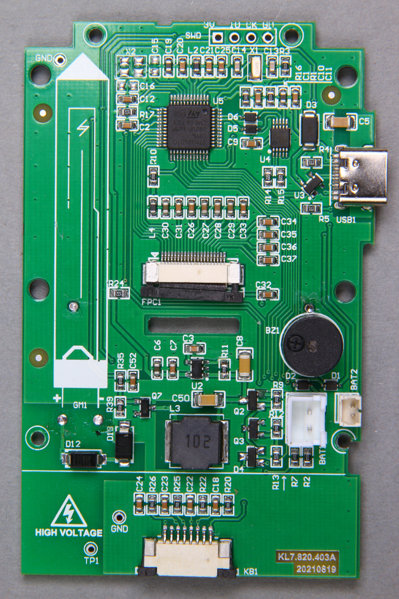
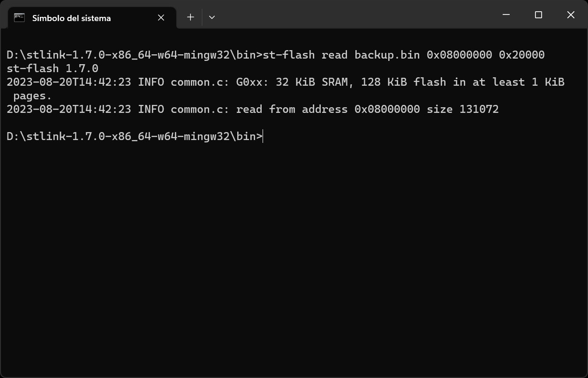
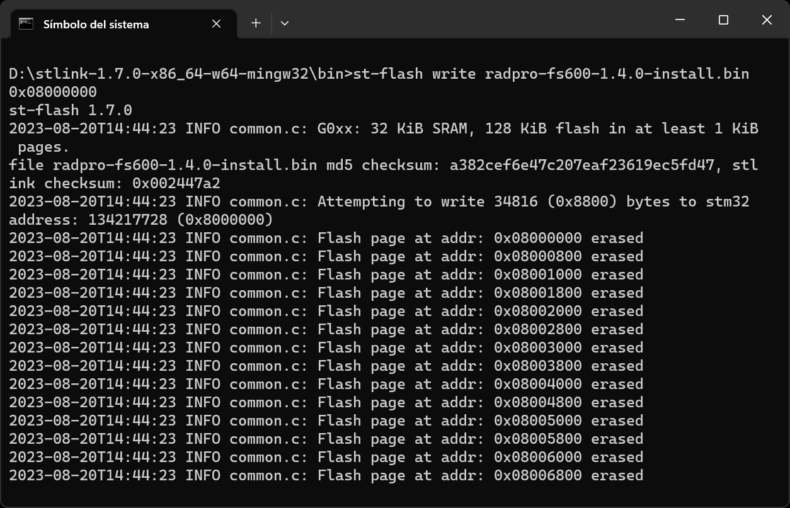
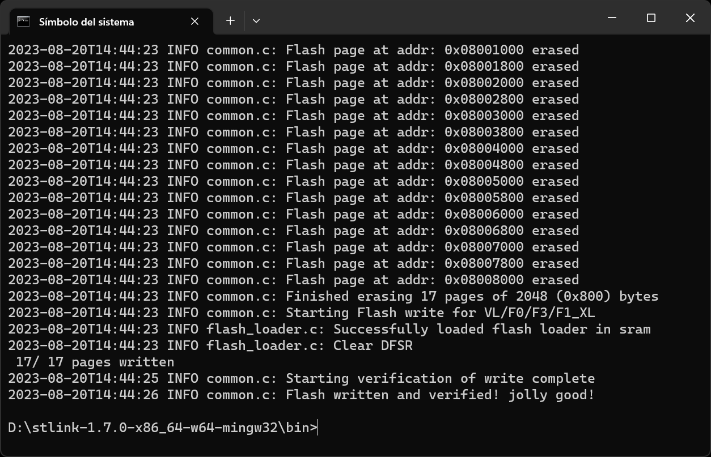

# Installing on the Bosean FS-600/FS-1000

## Supplies

To install Rad Pro on your Bosean FS-600 or FS-1000 Geiger counter, you will need the following tools and components:

* An [ST-Link V2 USB dongle (or clone)](https://www.amazon.com/s?k=st-link+v2)
* A soldering iron and solder
* A 4-pin header
* A Philips screwdriver
* The [stlink](https://github.com/stlink-org/stlink/releases) software (download the latest release for your operating system)
* If you use Windows, the [ST-LINK driver](https://www.st.com/en/development-tools/stsw-link009.html).

## Step 1: Open the device

Follow these steps to start installing Rad Pro:

* Remove the battery cover and batteries.
* Remove the screws holding the back case.
* Disconnect the battery connected to BAT1.
* Remove the screws holding the electronics board to the front case.
* Remove the electronics board.

The board should look like in the photo above. If it does not, you may have a different hardware revision. In this case, Rad Pro may not function properly.

If your board looks different and Rad Pro does not work, create an issue on https://github.com/Gissio/radpro/issues.

## Step 2: Connect the programmer

Now, follow these steps:

* Solder the 4-pin header to SWD on the board.
* If you use Windows, install the [ST-LINK driver](https://www.st.com/en/development-tools/stsw-link009.html).
* Connect the ST-Link V2 device to SWD. The pins, from left to right, are:
  * +3.3V
  * SWDIO
  * SWCLK
  * GND

Make sure the electrical connections are correct. You may break your device if the connections are not correct.

## Step 3: Back up the original firmware

Before installing for the first time, back up the original firmware. If you skip this step, you won't be able to restore your device if something goes wrong, so it is important you do it right.

To create a backup, open a terminal and go to the bin folder within the stlink folder.

Then, copy+paste the following command and verify that the resulting file, `backup.bin`, has a size of 131072 bytes:

    st-flash read backup.bin 0x08000000 0x20000

## Step 4: Flash the firmware

Now, download the latest firmware from the [Rad Pro releases](https://github.com/Gissio/radpro/releases):

* If your device is an FS-600, download ``radpro-bosean-fs600-x.y.z-install.bin`` when installing for the first time or `radpro-bosean-fs600-x.y.z-update.bin` when updating.
* If your device is an FS-1000, download `radpro-bosean-fs1000-x.y.z-install.bin` when installing for the first time or `radpro-bosean-fs1000-x.y.z-update.bin` when updating.

Next, run this command in the terminal:

    st-flash write [firmware-filename] 0x08000000

## Step 5: Finish up

* Reconnect the battery connector to BAT1.
* Close the device.
* To enable USB data logging under Windows, install the [CH340 driver](https://www.catalog.update.microsoft.com/Search.aspx?q=USB%5CVID_1A86%26PID_7523).

## Step 6: Configure your device

Last, start your device and go to Rad Pro's settings, select "Geiger tube", select "HV Profile" and choose an appropriate HV profile: "Energy-saving" is ideal for measuring background levels of radiation, while "Accuracy" consumes more power but allows measuring higher radiation levels; "Factory default" is the profile from the original firmware and consumes considerably more power.

## Step 7: Getting involved

If you like Rad Pro, consider watching the project to you get notified when new releases are out. Also, show your support by starring the project on GitHub.

## Hardware-specific notes

On the FS-600, the keys are mapped as follows:

  * Power on/off: long press of the ok/power key.
  * Go up/down: the up and down keys.
  * Hold measurement: the ok/power or left/back key.
  * Reset measurement: long press of the left/back key.
  * Enter settings: the right/settings key.
  * Select option: the ok/power or right/settings key.
  * Bo back: the left/back key.

On the FS-1000, the keys are mapped as follows:

  * Power on/off: extended press of the set/power key.
  * Go up: the mode key.
  * Go down: the set/power key.
  * Enter settings/select option: long press of the set/power key.
  * Hold measurement/go back: long press of the mode key.
  * Reset measurement: long press of both the mode and set/power keys.

Not all devices support the pulse LED.

On the FS-600 and FS-1000, Rad Pro can store up to 91080 data points. At normal radiation levels, this allows for 63 days of data at 1-minute intervals, 158 days at 5-minute intervals, 316 days at 10-minute intervals, 948 days at 30-minute intervals, and 1897 days at 60-minute intervals.

The FS-600 and FS-1000 include two Zener diodes that limit the maximum voltage to 440 V (nominal).

The FS-600 and FS-1000 HV profile settings are:

* Factory default: 40 kHz frequency and 50 % duty cycle.
* Accuracy: 2.5 kHz frequency and 6.5 % duty cycle.
* Energy-saving: 2.5 kHz frequency and 3.0 % duty cycle.
