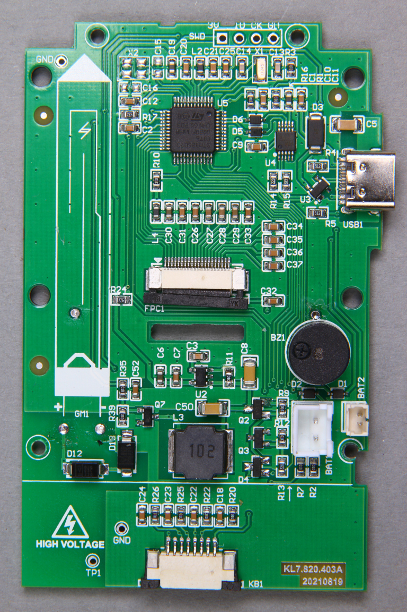
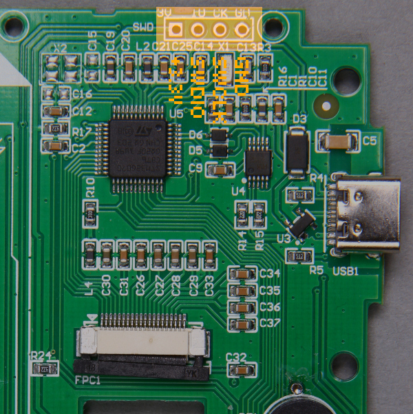

# Installing Rad Pro on the Bosean FS-600/FS-1000

This guide explains how to install **Rad Pro** on Bosean FS-600 and FS-1000 Geiger counters.

If Rad Pro is already installed on your device, you can upgrade using the [Rad Pro web installer](https://gissio.github.io/radpro-installer/).

## What You'll Need

Make sure you have:

* An **ST-LINK V2 programmer** (or compatible clone)
* A **4-pin header** or jumper wires (for SWD connection)
* A **Phillips screwdriver**
* A **computer** (Windows, Linux, or macOS)

Optional:

* Soldering iron + solder

Windows only:

* Install the ST-LINK driver:
  [https://www.st.com/en/development-tools/stsw-link009.html](https://www.st.com/en/development-tools/stsw-link009.html)

## Step 1: Download the Firmware

1. Go to the Rad Pro releases page: https://github.com/Gissio/radpro/releases
2. Download the latest `radpro-[version].zip`.
3. Extract it on your computer.

## Step 2: Open the Device

1. Power off the device.
2. Unscrew the back case.
3. Carefully open the enclosure.

## Step 3: Connect the ST-LINK Programmer

Locate the **SWD pads** on the board.

### Wiring (left to right)

Connect the ST-LINK as follows:

* 3.3V → 3.3V
* SWDIO → SWDIO
* SWCLK → SWCLK
* GND → GND

### Tips

* For a reliable connection, solder a 4-pin header to SWD

⚠️ Double-check all connections before powering anything. Incorrect wiring can damage the device.

## Step 4: Flash Rad Pro

1. Open the extracted firmware folder: `bosean-fs600/` or `bosean-fs1000/`
2. Run the Installer:
   * **Windows:** double-click `install.bat`
   * **Linux:** run `./install.sh` in a terminal
   * **macOS:** open Terminal and run `install.sh`
3. When prompted, enter your preferred language (e.g., `en`, `es`)

The original firmware is automatically **backed up** into the `backup/` folder

Rad Pro is flashed to the device.

> Keep the backup file safe—you'll need it to restore the original firmware.

### Restoring Original Firmware

* **Windows:** drag the backup file onto `install.bat`
* **Linux/macOS:** pass the backup file to `install.sh`

## Step 5: Reassemble the Device

* Disconnect the ST-LINK
* Reassemble the device

## Step 6: Basic Controls

Once installed, here are the essential controls:

### Bosean FS-600

#### Navigation

* **Press Up / Down:** Change measurement mode / navigate menus
* **Press Right:** Select / open settings
* **Press Back:** Go back

#### System

* **Hold OK:** Power on/off
* **Hold Back + OK:** Toggle lock mode

### Measurement Screen

* **Press Back:** Switch secondary display
* **Hold Back:** Reset measurement / dismiss alerts
* **Hold Right:** Toggle pulse sound
* **Press OK:** Turn off display

#### Random generator

* **Press Right:** Restart random generator

### Bosean FS-1000

#### Navigation

* **Press Mode / Set:** Change measurement mode / navigate menus
* **Short Hold Set:** Select / open settings
* **Short Hold Mode:** Go back

#### System

* **Long Hold Set:** Power on/off
* **Long Hold Mode + Set:** Toggle lock mode

### Measurement Screen

* **Press Mode:** Switch secondary display
* **Long Hold Mode:** Reset measurement / dismiss alerts

#### Random generator

* **Short Hold Set:** Restart random generator

## Step 7: Finish Up

* 📖 **Read the documentation**:
  * [Rad Pro user's manual](../../users-manual.md) – Easy guide to using Rad Pro
  * [Rad Pro reference manual](../../reference-manual.md) – Technical reference for Rad Pro
  * [Ionizing radiation field guide](https://github.com/Gissio/ionizing-radiation-field-guide) – Learn about ionizing radiation
* ⭐ **Support the project** by starring the repository: [https://github.com/Gissio/radpro](https://github.com/Gissio/radpro)
* 👥 **Help us grow** — share Rad Pro on social networks, forums, or with fellow enthusiasts!

## Hardware Notes

<!-- Calculated as follows:

* With 1-byte differential values: [42 pages * (1 timestamp record/page [16 bytes] + 2032 differential records/page [1 byte each])] = 85386 records
* With 2-byte differential values: [42 pages * (1 timestamp record/page [16 bytes] + 1016 differential records/page [2 byte each])] = 42714 records

* 60-minute and 10-minute intervals require 2-byte differential values.
* 1-minute intervals and less require 1-byte differential values.

 -->

### Data Storage Capacity

Rad Pro stores up to **85,386 measurements**.

At typical background radiation (~20 CPM), this corresponds to:

* **60-minute interval:** ~1779 days
* **10-minute interval:** ~296 days
* **1-minute interval:** ~59 days
* **10-second interval:** ~9 days
* **1-second interval:** ~23 hours

### Electrical Characteristics

* **HV voltage:** 440 V max (Zener-limited)
* Pulse LED: Not supported on all devices

### High Voltage (HV) Profiles

* **Factory default:**
  40 kHz frequency, 50% duty cycle

* **Accuracy:**
  2.5 kHz frequency, 6.5% duty cycle

* **Energy-saving mode:**
  2.5 kHz frequency, 3.0% duty cycle
