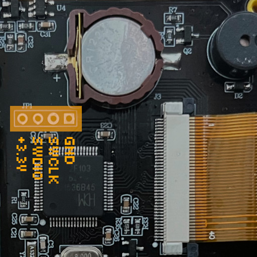

# Installing Rad Pro on the FNIRSI GC-01 with an STLINK dongle

These instructions let you install Rad Pro on FNIRSI GC-01 devices with a CH32F103R8T6 (WCH) or APM32F103RBT6 (Geehy) microprocessor if you:

* cannot access the USB drive as described in the [main installation instructions](install.md).
* want to install Rad Pro from macOS or Linux.
* your FNIRSI GC-01 became irresponsive and you need to recover your device.

**WARNING:** Rad Pro is incompatible with devices with a CACHIP microprocessor. Following these instructions with such devices WILL BREAK YOUR DEVICE.

## Supplies

To install Rad Pro on your FNIRSI GC-01 Geiger counter with a USB dongle, you will need the following tools and components:

* An [ST-Link V2 USB dongle (or clone)](https://www.amazon.com/s?k=st-link+v2)
* A 4-pin header
* A Philips screwdriver
* Optional: A soldering iron and solder
* If you use Windows, the [ST-LINK driver](https://www.st.com/en/development-tools/stsw-link009.html).

## Step 1: Open the device

Follow these steps to start installing Rad Pro:

* Turn off the device.
* Remove the screws holding the back panel and open the device.
* Disconnect the large battery.
* Take note of the MCU (microprocessor) installed in your device: CH32F103R8T6 (WCH) or APM32F103RBT6 (Geehy). The picture above should help you identify the MCU.
* Also, take note of the type of Geiger tube: the markings on the glass should be either J321 (as in the picture above), J305 or J614. If you have an unmarked tube measuring 55 or 65 mm long, you probably have a J614 or J613 tube, respectively.

The board should look like in the photo above. If it does not, you may have a different hardware revision. In this case, Rad Pro may not function properly.

**WARNING:** Rad Pro is incompatible with devices with a CACHIP microprocessor. Following these instructions with such devices WILL BREAK YOUR DEVICE.

## Step 2: Connect the programmer

Now, follow these steps:

* Optional: Solder the 4-pin header to the JP1 pads of the board.
* If you use Windows, install the [ST-LINK driver](https://www.st.com/en/development-tools/stsw-link009.html).
* Connect the ST-Link V2 device to SWD. The pins, from left to right, are:
  * +3.3V
  * SWDIO
  * SWCLK
  * GND

Make sure the electrical connections are correct. You may break your device if the connections are not correct.

## Step 3: Flash the firmware

Now, download the latest `radpro-flashtool` from the [Rad Pro releases](https://github.com/Gissio/radpro/releases).

* To install from Windows, start the `install-fnirsi-gc01-[mcu].bat` script.
* To install from macOS or Linux, start the `install-fnirsi-gc01-[mcu].sh` script.

`[mcu]` is the type of microprocessor of your board: `ch32f103r8t6` or `apm32f103rbt6`.

After successfully flashing the firmware, reconnect the battery connector and close the device.

Now, proceed to [step 3 of the main installation instructions](install.md#step-3-configure-your-device).
