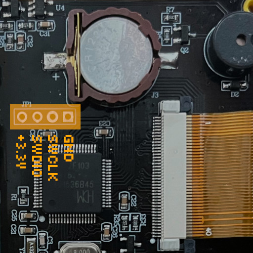

# Installing Rad Pro on the FNIRSI GC-01/JOY-IT JT-RAD01 (ST-LINK Method)

This guide explains how to install **Rad Pro** on FNIRSI GC-01 and JOY-IT JT-RAD01 Geiger counters using an **ST-LINK programmer**.

Use this method if:

* The standard installation method fails
* The device is unresponsive and needs recovery

## What You'll Need

Make sure you have:

* An **ST-LINK V2 programmer** (or compatible clone)
* A **4-pin header** or jumper wires (for SWD connection)
* A **Phillips screwdriver**
* A **computer** (Windows, Linux, or macOS)

Optional:

* Soldering iron + solder

Windows only:

* Install the ST-LINK driver:
  [https://www.st.com/en/development-tools/stsw-link009.html](https://www.st.com/en/development-tools/stsw-link009.html)

## Step 1: Download the Firmware

1. Go to the Rad Pro releases page: https://github.com/Gissio/radpro/releases
2. Download the latest `radpro-[version].zip`.
3. Extract it on your computer.

## Step 2: Identify the Hardware

To select the correct firmware and settings, you'll need to identify two components inside the device.

### Open the Device

1. Power off the GC-01.
2. Unscrew the back case.
3. Carefully open the enclosure.

### Identify the Microprocessor

Look for the square chip on the board. It should be one of:

* CH32F103R8T6 (WCH)
* APM32F103RBT6 (Geehy)

If the chip is unmarked or unclear, don't worry—proceed to the next step.

### Identify the Geiger Tube

Look for markings on the tube:

* **J305**, **J321**, **J613**, **HH614**, or **M4011**

If the tube is unmarked:

* ~55 mm or ~65 mm → assume **HH614**

## Step 3: Connect the ST-LINK Programmer

Locate the **JP1 pads** on the board.

### Wiring

If pads are unlabeled (left → right):

* 3.3V
* SWDIO
* SWCLK
* GND

If pads are labeled:

* CLK → SWCLK
* DIO → SWDIO
* GND → GND
* VCC → 3.3V

### Tips

* For a reliable connection, solder a 4-pin header to JP1

⚠️ Double-check all connections before powering anything. Incorrect wiring can damage the device.

## Step 4: Flash Rad Pro

1. Open the extracted firmware folder: `fnirsi-gc01_[microprocessor]/`
   * `[microprocessor]` is `ch32f103r8t6` or `apm32f103rbt6`
2. Run the Installer:
   * **Windows:** double-click `install.bat`
   * **Linux:** run `./install.sh` in a terminal
   * **macOS:** open Terminal and run `install.sh`
3. When prompted, enter your preferred language (e.g., `en`, `es`)

Rad Pro is flashed to the device.

## Step 5: Finish Up

* Disconnect the ST-LINK
* Reassemble the device

## Next Step

Once Rad Pro is installed, continue with:

* [Regular installation guide](install.md#step-5-first-configuration) → Step 5: First Configuration
