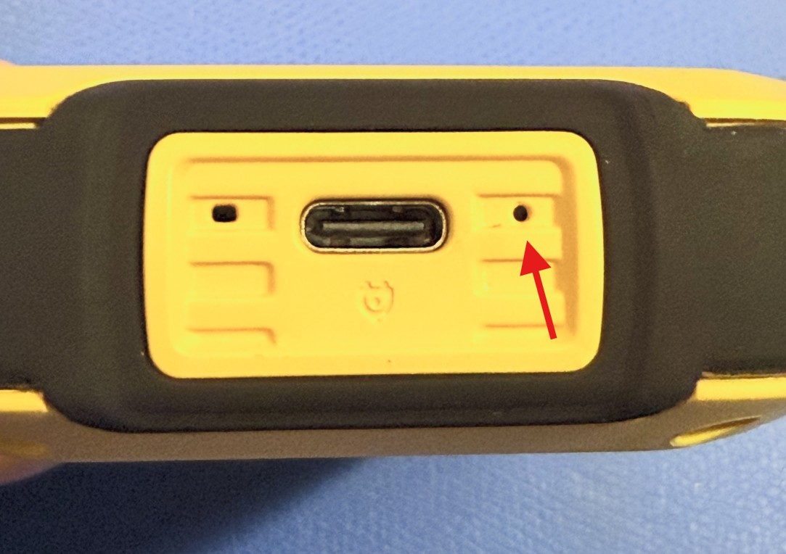

# Installing Rad Pro on FNIRSI GC-01/JOY-IT JT-RAD01 Geiger counters

This guide explains how to install the Rad Pro firmware on FNIRSI GC-01 and JOY-IT JT-RAD01 Geiger counters.

## What you'll need

* **USB data cable:** Must support data transfer, not just charging.
* **Philips screwdriver:** For opening the device.

## Step 1: Open the device

1. Power off the device.
2. Unscrew the back case and carefully open the device.
3. Identify the microprocessor (square chip): either **CH32F103R8T6 (WCH)** or **APM32F103RBT6 (Geehy)**. If unmarked, proceed to the next step.
4. Identify the Geiger-Müller tube, marked as **J305**, **J321**, **J613**, **J614**, or **M4011**. For unmarked tubes:
   * **55 mm tubes:** Assume J614.
   * **65 mm tubes:** Assume J613.
5. Reassemble the device.

## Step 2: Flash the firmware

1. Download and extract the latest `radpro-[version].zip` from [Rad Pro releases](https://github.com/Gissio/radpro/releases).
2. Connect the device to a **Windows computer** using a **USB 2.0 port** and the USB data cable. **Note:** Installation may fail on macOS, Linux, or USB 3.0 ports.
3. Power on the device. A USB drive should appear on your computer. If the drive does not immediately enumerate, then try some of the steps below:
   * Some devices require holding the **Power** button from power-on until the firmware is copied and the device restarts.
   * Others may need the **Right/Settings** and **OK/Power** keys pressed together to make the USB drive available.
   * Some devices require pressing a BOOT button near the USB port (see more details below)
4. If you identified the microprocessor, navigate to the `fnirsi-gc01_[micropreocessor]/install` folder. Select the appropriate firmware file: `radpro-fnirsi-gc01_[microprocessor]-[language]-x.y.z-install.bin`.
   * `[microprocessor]`: `ch32f103r8t6` or `apm32f103rbt6`.
   * `[language]` Two-letter code for your preferred language (e.g., `en` for English).
5. If the microprocessor is unmarked, try `apm32f103rbt6` firmware first. If a **Drive full** error occurs, disconnect the device, then retry with `ch32f103r8t6`.
6. Copy the selected firmware file to the USB drive. The device should restart automatically with Rad Pro installed.
   * Some users report that it is necessary to copy the file to the USB drive twice.

**BOOT Button Instructions:**

It is important to note that, with the stock firmware, there is a small delay between pressing the power button and the stock UI appearing. Keep this in mind during the steps below. 

1. Plug the USB data cable into the GC-01 and your PC. **The cable that ships with the GC-01 may not be a data cable!**
2. Make sure the GC-01 is powered off.
3. Locate a paper clip or small screwdriver you can use to press the BOOT button. 
   * CAUTION: Do not attempt to press the button while holding the bare board! The process requires powering on the device, so the risk of contacting the high voltage power supply is very high!
   
   

4. While pressing and **holding** the power button, quickly **press and release** the BOOT button. 
   * This takes some practice and might require a few tries to get right. 
   * The BOOT button should be pressed for about 1 second. 
   * It can help to have the Device Manager visible so you know when the device was correctly enumerated. 
   * The GC-01 must be powered on **without** the BOOT button pressed, but the button press has to be registered **before** the application starts. The button press has to be registered *only* during the small delay between pressing the power button and the stock UI appearing. 
   * The GC-01 will not fully power on or enumerate over USB if the BOOT button is held down before pressing the power button. Pressing the BOOT button after the application is running will cause the application to reboot and will not enable USB enumeration. 

**Troubleshooting:**

* If the installation fails, press the **BOOT button** next to the USB connector and repeat the process.
* To restore the original firmware, copy the [original firmware](firmware) to the USB drive.
* For persistent issues, follow the [FNIRSI GC-01 alternative installation instructions](install-stlink.md).

## Step 3: Configure the device

Use the following controls to operate your device:

* **Power on/off:** Press and hold the OK/Power key.
* **Switch measurement mode:** Use the Up or Down key.
* **Switch secondary measurement view:** Press the Left/Back key.
* **Reset measurement/dismiss alert:** Press and hold the Left/Back key.
* **Toggle pulse sound (measurement view only):** Press and hold the Right/Settings key.
* **Sleep display (measurement view only):** Press the OK/Power key.
* **Access settings:** Press the Right/Settings key.
* **Navigate options:** Use the Up or Down key.
* **Select option:** Press the OK/Power or Right/Settings key.
* **Go back:** Press the Left/Back key.
* **Toggle lock mode:** Press and hold both the Left/Back and OK/Power keys.

To configure the device:

1. Go to **Settings > Geiger tube > Sensitivity** and select the option that matches your Geiger-Müller tube.
2. Go to **Geiger tube > HV Profile** and select:
  * **Energy-saving:** Lowest power use, best for background radiation.
  * **Accuracy:** Higher power use, ideal for elevated radiation levels.
  * **Factory default:** Highest power use, matches original firmware settings.
3. If the device registers unintended key presses, select the **Energy-saving** HV profile or configure a custom HV profile to resolve the issue.

## Step 4: Support Rad Pro

If you find Rad Pro useful:

* Watch the [Rad Pro GitHub repository](https://github.com/Gissio/radpro) for release updates.
* Star the project to show your support.

## Hardware-specific notes

### FNIRSI GC-01/JOY-IT JT-RAD01 with CH32F103R8 (WCH) microprocessor

* Enable **Data Mode** in the settings to establish a USB data connection. Disable when not in use to save power.

<!-- Calculated as follows:

* With 1-byte differential values: [5 pages * (1 timestamp record/page [10 bytes] + 1012 differential records/page [1 byte each])] = 5065 records
* With 2-byte differential values: [5 pages * (1 timestamp record/page [10 bytes] + 506 differential records/page [2 byte each])] = 2535 records

* 60-minute and 10-minute intervals require 2-byte differential values.
* 1-minute intervals and less require 1-byte differential values.

 -->

* **Data storage:** Stores up to 6,078 data points. At 20 cpm (normal radiation levels), this supports:
  * 105 days at 60-minute intervals
  * 17 days at 10-minute intervals
  * 84 hours at 1-minute intervals
  * 14 hours at 10-second intervals
  * 84 minutes at 1-second intervals

* **HV profile settings:**
  * Factory default: 9.207 kHz frequency, 75% duty cycle.
  * Energy-saving: 5 kHz frequency, 1.5% duty cycle.

### FNIRSI GC-01/JOY-IT JT-RAD01 with APM32F103R8 (Geehy) processor

* The USB data connection is always available.

<!-- Calculated as follows:

* With 1-byte differential values: [73 pages * (1 timestamp record/page [10 bytes] + 1012 differential records/page [1 byte each])] = 73949 records
* With 2-byte differential values: [73 pages * (1 timestamp record/page [10 bytes] + 506 differential records/page [2 byte each])] = 37011 records

* 60-minute and 10-minute intervals require 2-byte differential values.
* 1-minute intervals and less require 1-byte differential values.

 -->

* **Data storage:** Stores up to 67,871 data points. At 20 cpm (normal radiation levels), this supports:
  * 1542 days at 60-minute intervals
  * 257 days at 10-minute intervals
  * 51 days at 1-minute intervals
  * 8 days at 10-second intervals
  * 20 hours at 1-second intervals

* **HV profile settings:**
  * Factory default: 47.058 kHz frequency, 50% duty cycle.
  * Energy-saving: 5 kHz frequency, 1.5% duty cycle.
