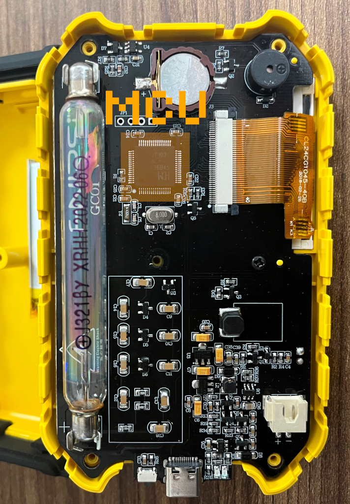

# Installing Rad Pro on the FNIRSI GC-01/JOY-IT JT-RAD01

This guide explains how to install **Rad Pro** on FNIRSI GC-01 and JOY-IT JT-RAD01 Geiger counters.

## What You'll Need

Make sure you have:

* A **USB data cable** (charging-only cables will not work)
* A **Phillips screwdriver**
* A **computer** running Windows 10 or Windows 11

### Important Warning

⚠️ **DO NOT attempt installation from macOS or Linux.** These operating systems are **not supported** and can brick your device. You will need a Windows 10/11 computer to recover it if something goes wrong.

## Step 1: Download the Firmware

1. Go to the Rad Pro releases page: https://github.com/Gissio/radpro/releases
2. Download the latest `radpro-[version].zip`.
3. Extract it on your computer.

## Step 2: Identify the Hardware

To select the correct firmware and settings, you'll need to identify two components inside the device.

### Open the Device

1. Power off the device.
2. Unscrew the back case.
3. Carefully open the enclosure.

### Identify the Microprocessor

Look for the square chip on the board. It should be one of:

* CH32F103R8T6 (WCH)
* APM32F103RBT6 (Geehy)

If the chip is unmarked or unclear, don't worry—proceed to the next step.

### Identify the Geiger Tube

Look for markings on the tube:

* **J305**, **J321**, **J613**, **HH614**, or **M4011**

If the tube is unmarked:

* ~55 mm or ~65 mm → assume **HH614**

### Reassemble the Device

Once identified, close the device and screw it back together.

## Step 3: Flash Rad Pro

### Connect the Device

1. Connect the device to your computer.
2. A **USB drive** should appear.

   > If no drive appears, your device may be incompatible.

3. Open the extracted firmware folder: `fnirsi-gc01_[microprocessor]/firmware/` and choose the correct firmware file: `radpro-fnirsi-gc01_[microprocessor]-[language]-x.y.z-install.bin`
   * `[microprocessor]` is `ch32f103r8t6` or `apm32f103rbt6`
   * `[language]` is a two-letter code (e.g., `en`, `es`)
   * Not sure about the microprocessor? Start with `apm32f103rbt6`. If you get a **Drive full** error, disconnect the device and retry using `ch32f103r8t6`.
4. Copy the file to the USB drive.

The device will automatically reboot when the transfer completes.

After reboot, **Rad Pro is installed**.

### Troubleshooting

**Device does not reboot after copying:**

* Safely eject the drive and reconnect
* Try copying the file again

**Device not detected:**

* Check your USB cable (must support data)
* Try another USB port

**Want to go back to stock firmware?**

* Copy the original firmware (in the [firmware](firmware) folder) to the device using the same process

**Still no joy?**

* Try the alternative installation instructions: [install-stlink.md](install-stlink.md)

<!--
If installation fails, try the following:

* Hold **OK/Power** while powering on and keep holding during the process
* Hold **Right/Settings + OK/Power** to expose the USB drive
* Press the **reset switch** (near the USB connector) after plugging in
* Copy the file **twice**

If needed:

* Press the reset switch and retry the full process
* Use the alternative method: `install-stlink.md` 
-->

## Step 4: Basic Controls

Once installed, here are the essential controls:

### Navigation

* **Press Up / Down:** Change measurement mode / navigate menus
* **Press Right:** Select / open settings
* **Press Left:** Go back

### System

* **Hold OK:** Power on/off
* **Hold Left + OK:** Toggle lock mode

### Measurement Screen

* **Press Left:** Switch secondary display
* **Hold Left:** Reset measurement / dismiss alerts
* **Hold Right:** Toggle pulse sound
* **Press OK:** Turn off display

### Random generator

* **Press Right:** Restart random generator

## Step 5: First Configuration

* Open **Settings > Geiger tube > Tube type**.
* Select the tube you identified earlier.

## Step 6: Finish Up

* 📖 **Read the documentation**:
  * [Rad Pro user's manual](../../users-manual.md) – Easy guide to using Rad Pro
  * [Rad Pro reference manual](../../reference-manual.md) – Technical reference for Rad Pro
  * [Ionizing radiation field guide](https://github.com/Gissio/ionizing-radiation-field-guide) – Learn about ionizing radiation
* ⭐ **Support the project** by starring the repository: [https://github.com/Gissio/radpro](https://github.com/Gissio/radpro)
* 👥 **Help us grow** — share Rad Pro on social networks, forums, or with fellow enthusiasts!

## Hardware Notes

### CH32F103R8 (WCH) Devices

<!-- Calculated as follows:

* With 1-byte differential values: [5 pages * (1 timestamp record/page [10 bytes] + 1014 differential records/page [1 byte each])] = 5075 records
* With 2-byte differential values: [5 pages * (1 timestamp record/page [10 bytes] + 507 differential records/page [2 byte each])] = 2540 records

* 60-minute and 10-minute intervals require 2-byte differential values.
* 1-minute intervals and less require 1-byte differential values.

 -->

#### Data Storage Capacity

Rad Pro stores up to **5,075 measurements**.

At typical background radiation (~20 CPM), this corresponds to:

* **60-minute interval:** ~105 days
* **10-minute interval:** ~17 days
* **1-minute interval:** ~84 hours
* **10-second interval:** ~14 hours
* **1-second interval:** ~84 minutes

#### High Voltage (HV) Profiles

* **Factory default:**
  9.207 kHz frequency, 75% duty cycle

### APM32F103R8 (Geehy) Devices

<!-- Calculated as follows:

* With 1-byte differential values: [71 pages * (1 timestamp record/page [10 bytes] + 1014 differential records/page [1 byte each])] = 72065 records
* With 2-byte differential values: [71 pages * (1 timestamp record/page [10 bytes] + 507 differential records/page [2 byte each])] = 36068 records

* 60-minute and 10-minute intervals require 2-byte differential values.
* 1-minute intervals and less require 1-byte differential values.

 -->

#### Data Storage Capacity

Rad Pro stores up to **72,065 measurements**.

At typical background radiation (~20 CPM), this corresponds to:

* **60-minute interval:** ~1502 days
* **10-minute interval:** ~250 days
* **1-minute interval:** ~50 days
* **10-second interval:** ~8 days
* **1-second interval:** ~20 hours
