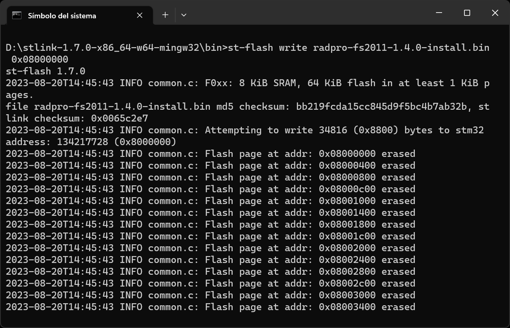
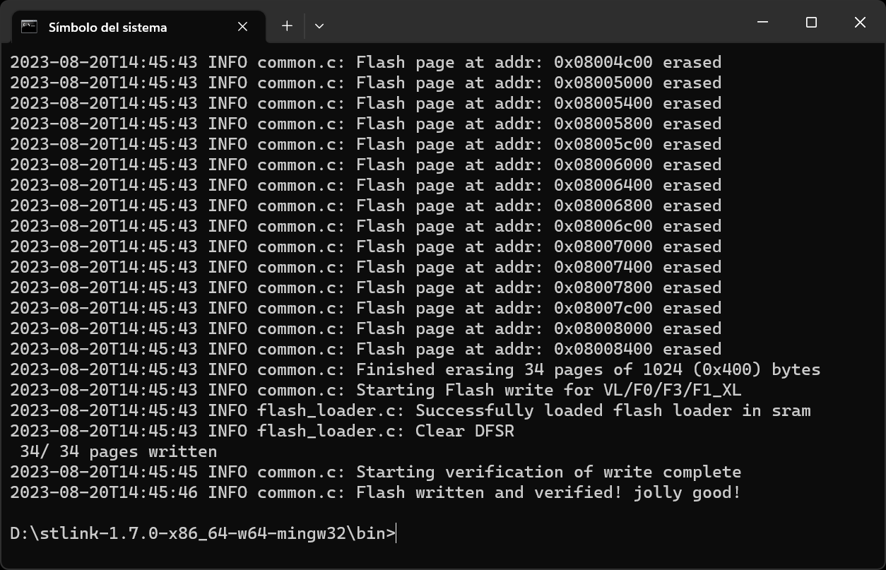
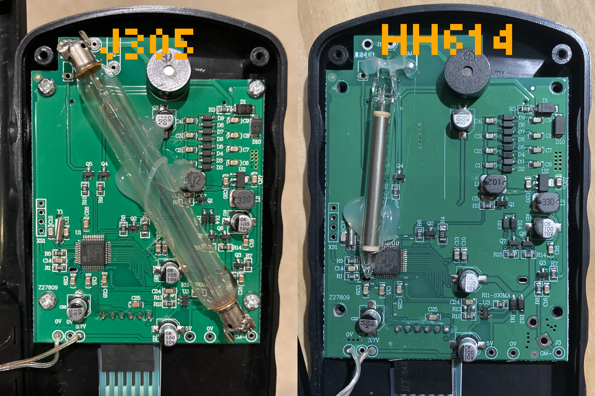

# Installing on the FS2011/YT-203B

## Supplies

To install Rad Pro on your FS2011 or YT-203B Geiger counter, you will need the following tools and components:

* An [ST-Link V2 USB dongle (or clone)](https://www.amazon.com/s?k=st-link+v2)
* A soldering iron and solder
* A 4-pin header
* A Philips screwdriver
* The [stlink](https://github.com/stlink-org/stlink/releases) software (download the latest release for your operating system)
* If you use Windows, the [ST-LINK driver](https://www.st.com/en/development-tools/stsw-link009.html).

## Step 1: Open the device

Follow these steps to start installing Rad Pro:

* Remove the battery cover and batteries.
* Remove the screws holding the back case.
* Remove the screws holding the electronics board to the front case.
* Remove the electronics board.

The board should look like in the photos above (the tube may be different). If it does not, you may have a different hardware revision. In this case, Rad Pro may not function properly.

If your board looks different and Rad Pro does not work, create an issue on https://github.com/Gissio/radpro/issues.

## Step 2: Connect the programmer

Now, follow these steps:

* Solder the 4-pin header to XS1 on the board.
* If you use Windows, install the [ST-LINK driver](https://www.st.com/en/development-tools/stsw-link009.html).
* Connect the ST-Link V2 device to XS1. The pins, from top to bottom, are:
  * GND
  * SWCLK
  * SWDIO
  * +3.3V

Make sure the electrical connections are correct. You may break your device if the connections are not correct.

## Step 3: Back up the original firmware

Before installing for the first time, back up the original firmware. If you skip this step, you won't be able to restore your device if something goes wrong, so it is important you do it right.

To create a backup, open a terminal and go to the bin folder within the stlink folder.

Then, copy+paste the following command and verify that the resulting file, `backup.bin`, has a size of 65536 bytes:

    st-flash read backup.bin 0x08000000 0x10000

## Step 4: Flash the firmware

Now, download the latest firmware from the [Rad Pro releases](https://github.com/Gissio/radpro/releases): 

* For initial installation, download `radpro-fs2011-[MCU]-x.y.z-install.bin`.
* For updating, download `radpro-fs2011-[MCU]-x.y.z-update.bin`.

`[MCU]` is the type of microprocessor on your board: `STM32F051`, `GD32F150` or `GD32F103`.

Next, run this command in the terminal:

    st-flash write [firmware-filename] 0x08000000

After successfully flashing the firmware, close the device.

## Step 5: Configure your device

Start your device and go to Rad Pro's settings, select "Geiger tube", "Conversion factor", and select the option that matches the Geiger-Müller tube installed in your device. The photos above should help you identify the tube.

Within the "Geiger tube" settings, select "HV Profile" and choose an appropriate HV profile: "Energy-saving" is ideal for measuring background levels of radiation, while "Optimized" consumes more power but allows measuring higher radiation levels; "Factory default" is the profile from the original firmware and consumes considerably more power.

Last, read the [user's manual](../../users.md) for learning how to use Rad Pro.

## Step 6: Optional mods

* Add USB connectivity. You'll need: an [3.3 V USB serial converter](https://www.amazon.com/s?k=ftdi+board) and [wire-wrap](https://www.amazon.com/s?k=wirewrap+30). Important: never use batteries when powering from USB. Follow these instructions:
  * Set up the serial converter for 3.3 V.
  * Connect the serial converter's GND and 5V pins to the FS2011 board's 0V and 5V pads, respectively.
  * Connect the PA2 pin of the microprocessor to the serial converter's RX pin.
  * Connect the PA3 pin of the microprocessor to the serial converter's TX pin.
* For easier access to XS1, use a file to extend the hole for the battery holder clip so that a 4-pin header connector can fit. Solder four cables between XS1 and the 4-pin header. Using a glue gun, attach the header to the inside of the back case, so you can access the header with the battery case open.
* On some FS2011 devices, the tube is not aligned to the holes of the back case. For improved measurement, align the tube to the holes using a heat gun/glue gun. Be careful, as the tube's glass is very delicate.
* Some AA rechargeable batteries have low-profile caps that don't make electrical contact with the battery holder. To fix this problem, apply solder on the battery holder's pads.
* To increase the buzzer's volume, drill a hole on the back case in front of the buzzer.

## Step 7: Getting involved

If you like Rad Pro, consider watching the project to get notified when new releases are out. Also, show your support by starring the project on GitHub.

## Hardware-specific notes

The keys are mapped as follows:

  * Power on/off: long press of the power key.
  * Go up/down: the up and down keys.
  * Toggle measurement view: the play/pause or power key.
  * Reset measurement: long press of the play/pause key.
  * Enter settings: the menu/ok key.
  * Select option: the menu/ok or power key.
  * Go back: the play/pause key.

On the FS2011, Rad Pro can store up to 31372 data points. At normal radiation levels, this allows for 21 days of data at 1-minute intervals, 54 days at 5-minute intervals, 108 days at 10-minute intervals, 326 days at 30-minute intervals, and 653 days at 60-minute intervals.

The FS2011 includes two Zener diodes that limit the maximum voltage to 440 V (nominal).

The FS2011 HV profile settings are:

* Factory default: 40 kHz frequency and 50 % duty cycle.
* Accuracy: 2.5 kHz frequency and 6.5 % duty cycle.
* Energy-saving: 2.5 kHz frequency and 3.0 % duty cycle.
