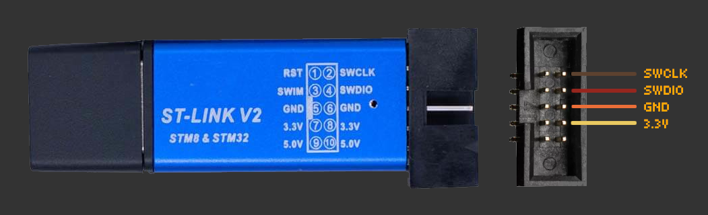

# Installing Rad Pro on the FS2011/YT-203B

## Supplies

To install Rad Pro on your FS2011 or YT-203B Geiger counter, you will need the following tools and components:

* An [ST-LINK V2 USB dongle (or clone)](https://www.amazon.com/s?k=st-link+v2)
* A 4-pin header
* A Philips screwdriver
* Optional: A soldering iron and solder
* If you use Windows, the [ST-LINK driver](https://www.st.com/en/development-tools/stsw-link009.html)

## Step 1: Open the device

Follow these steps to start installing Rad Pro:

* Turn off the device.
* Remove the battery cover and batteries.
* Remove the screws holding the back case and open the device.

The board should look like in the photos above (the tube may be different). If it does not, you may have a different hardware revision. In this case, Rad Pro may not function properly.

If your board looks different and Rad Pro does not work, create an [issue](https://github.com/Gissio/radpro/issues).

## Step 2: Connect the programmer

Now, follow these steps:

* Optional: Solder the 4-pin header to the XS1 pads of the board.
* If you use Windows, install the [ST-LINK driver](https://www.st.com/en/development-tools/stsw-link009.html).
* Connect the ST-Link V2 device to the XS1 pads. The pins, from top to bottom, are:
  * GND
  * SWCLK
  * SWDIO
  * 3.3V

Make sure the electrical connections are correct. You may break your device if the connections are not correct.

## Step 3: Flash the firmware

Now, download and unzip the latest `radpro-[version].zip` from the [Rad Pro releases](https://github.com/Gissio/radpro/releases).

* To install from Windows, go to the `fs2011` folder and double click `fs2011-[mcu]-[type].bat`.
* To install from Linux, go to the `fs2011` folder and start `fs2011-[mcu]-[type].sh`.
* To install from macOS, open `Terminal.app` (in `/Applications/Utilities`), go to the `fs2011` folder and drag the `fs2011-[mcu]-[type].sh` install file onto the Terminal icon in the dock.

`[mcu]` is the type of microprocessor on your board: `stm32f051c8`, `gd32f150c8` or `gd32f103c8`.

`[type]` is the type of installation: `install` or `update`. Note that not all releases support updating.

The installer will display a list of available languages as two-letter language codes. Select and enter the language code to proceed with the installation.

The installer automatically creates a backup of the original firmware in the `backup` folder, ensuring you can restore your device if needed. Store these backups securely to enable reversion to the original firmware. To restore a backup, drag it onto `fs2011-[mcu]-install.bat` (Windows) or `fs2011-[mcu]-install.sh` (macOS/Linux).

Before closing the device, take note of the type of Geiger tube: the markings on the glass should be either J321, J305, M4011 or J614. If you have an unmarked tube measuring 55 or 65 mm long, you probably have a J614 or J613 tube, respectively.

## Step 4: Configure your device

Start your device and go to Rad Pro's settings, select "Geiger tube", "Sensitivity", and select the option that matches the Geiger-Müller tube installed in your device.

Within the "Geiger tube" settings, select "HV Profile" and choose an appropriate HV profile: "Energy-saving" is best for measuring background levels of radiation, while "Accuracy" consumes more power but allows measurement of higher radiation levels; "Factory default" is the profile from the original firmware and consumes considerably more power.

Last, read the [user's manual](../../manual.md) for learning how to use Rad Pro, and the [ionizing radiation field guide](../../field-guide/field-guide.md) for learning more about ionizing radiation.

## Step 5: Optional mods

* Add USB connectivity. You'll need: a [3.3 V USB serial converter](https://www.amazon.com/s?k=ftdi+board) and [wire-wrap](https://www.amazon.com/s?k=wirewrap+30). Important: do not use batteries when powering from USB. Follow these instructions:
  * Set up the serial converter for 3.3 V.
  * Connect the serial converter's GND and 5V pins to the FS2011 board's 0V and 5V pads, respectively.
  * Connect the PA2 pin of the microprocessor to the serial converter's RX pin.
  * Connect the PA3 pin of the microprocessor to the serial converter's TX pin.
* Add a vibration device (which you can recover from an old cellphone). Solder one terminal to the output of the Q5 transistor, and the other terminal to 3.3 V.
* For easier access to XS1, use a file to extend the hole for the battery holder clip so that a 4-pin header connector can fit. Solder four cables between XS1 and the 4-pin header. Using a glue gun, attach the header to the inside of the back case, so you can access the header with the battery case open.
* On some FS2011 devices, the tube is not aligned to the holes of the back case. For improved measurement, align the tube to the holes using a heat gun/glue gun. Be careful, as the tube's glass is very delicate.
* Some AA rechargeable batteries have low-profile caps that don't make electrical contact with the battery holder. Fix this problem by applying solder on the battery holder's pads.
* To increase the buzzer's volume, drill holes on the back case, in front of the buzzer.

## Step 6: Last steps

If you like Rad Pro, consider watching the project to get notified when new releases are out. Also, show your support by starring the project on GitHub. And don't forget to read the keyboard mapping table below!

## Hardware-specific notes

The keys are mapped as follows:

  * Power on/off: long hold of the power key.
  * Switch measurement mode: the up and down keys.
  * Switch measurement secondary view: the play/pause key.
  * Reset measurement/dismiss alarm: long hold of the play/pause key.
  * Put display to sleep (measurement view only): the power key.
  * Enter settings: the menu/ok key.
  * Go up/down: the up and down keys.
  * Select option: the menu/ok or power key.
  * Go back: the play/pause key.
  * Toggle pulses sound: long hold of the menu/ok key.
  * Toggle lock mode: long hold of the power and play/pause key.

<!-- Calculated as follows:

* With 1-byte differential values: [23 pages * (1 timestamp entry/page [10 bytes] + 1012 differential entries/page [1 byte each])] = 23299 entries
* With 2-byte differential values: [23 pages * (1 timestamp entry/page [10 bytes] + 506 differential entries/page [2 byte each])] = 11661 entries

* 60-minute and 10-minute intervals require 2-byte differential values.
* 1-minute intervals and less require 1-byte differential values.

 -->

On the FS2011, Rad Pro can store up to 23299 data points. At normal radiation levels (20 cpm), this allows for 485 days of data at 60-minute intervals, 80 days at 10-minute intervals, 16 days at 1-minute intervals, almost 3 days at 10-second intervals and 6 hours at 1-second intervals.

The FS2011 includes two Zener diodes that limit the maximum voltage to 440 V (nominal).

The FS2011 HV profile settings are:

* Factory default: 40 kHz frequency and 50% duty cycle.
* Accuracy: 2.5 kHz frequency and 6.5% duty cycle.
* Energy-saving: 2.5 kHz frequency and 3.0% duty cycle.
