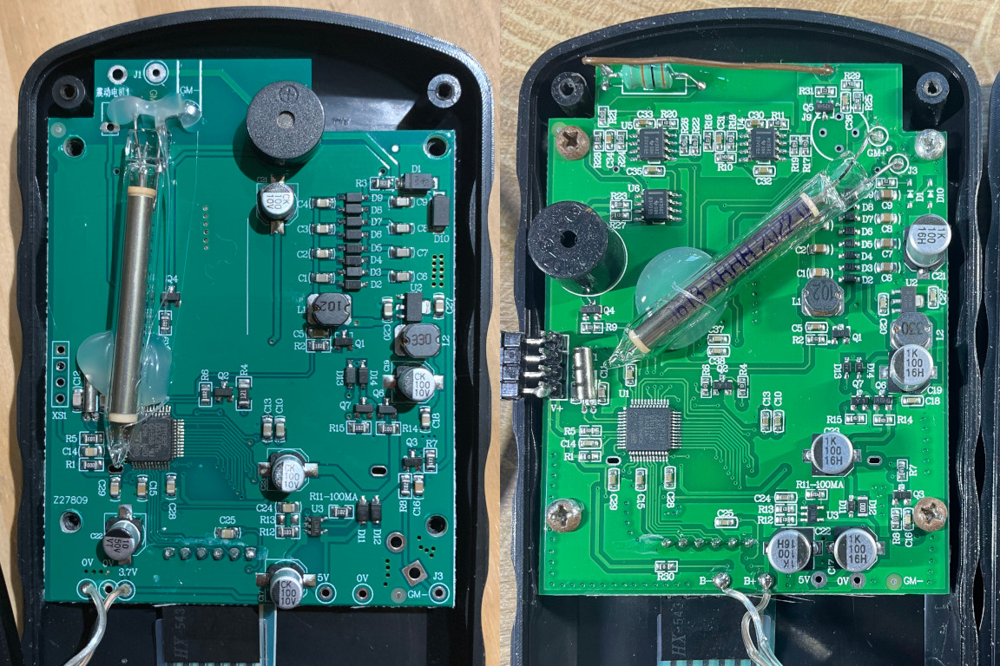
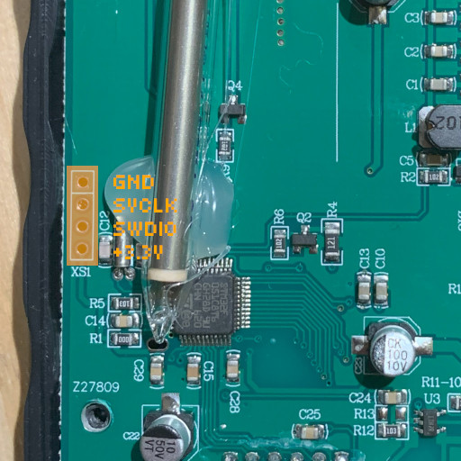
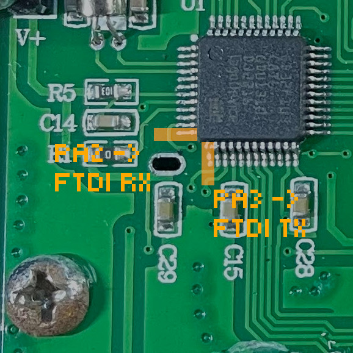

# Installing Rad Pro on the FS2011/YT-203B

This guide explains how to install **Rad Pro** on FS2011 and YT-203B Geiger counters.

## What You'll Need

Make sure you have:

* An **ST-LINK V2 programmer** (or compatible clone)
* A **4-pin header** or jumper wires (for SWD connection)
* A **Phillips screwdriver**
* A **computer** (Windows, Linux, or macOS)

Optional:

* Soldering iron + solder

Windows only:

* Install the ST-LINK driver:
  [https://www.st.com/en/development-tools/stsw-link009.html](https://www.st.com/en/development-tools/stsw-link009.html)

## Step 1: Download the Firmware

1. Go to the Rad Pro releases page: https://github.com/Gissio/radpro/releases
2. Download the latest `radpro-[version].zip`.
3. Extract it on your computer.

## Step 2: Identify the Hardware

To select the correct firmware and settings, you'll need to identify two components inside the device.

### Open the Device

1. Power off the device.
2. Unscrew the back case.
3. Carefully open the enclosure.

### Identify the Microprocessor

Look for the square chip on the board. It should be one of:

* **STM32F051C8**
* **GD32F150C8**
* **GD32F103C8**

### Identify the Geiger Tube

Look for markings on the tube:

* **J305**, **J321**, **J613**, **HH614**, or **M4011**

If the tube is unmarked:

* ~55 mm or ~65 mm → assume **HH614**

## Step 3: Connect the ST-LINK Programmer

Locate the **XS1 pads** on the board.

### Wiring (top to bottom)

Connect the ST-LINK as follows:

* GND → GND
* SWCLK → SWCLK
* SWDIO → SWDIO
* 3.3V → 3.3V

### Tips

* For a reliable connection, solder a 4-pin header to XS1

⚠️ Double-check all connections before powering anything. Incorrect wiring can damage the device.

## Step 4: Flash Rad Pro

1. Open the extracted firmware folder: `fs2011-[microprocessor]/`
   * `[microprocessor]` is `stm32f051c8`, `gd32f150c8` or `gd32f103c8`
2. Run the Installer:
   * **Windows:** double-click `install.bat`
   * **Linux:** run `./install.sh` in a terminal
   * **macOS:** open Terminal and run `install.sh`
3. When prompted, enter your preferred language (e.g., `en`, `es`)

The original firmware is automatically **backed up** into the `backup/` folder

Rad Pro is flashed to the device.

> Keep the backup file safe—you'll need it to restore the original firmware.

### Restoring Original Firmware

* **Windows:** drag the backup file onto `install.bat`
* **Linux/macOS:** pass the backup file to `install.sh`

## Step 5: Reassemble the Device

* Disconnect the ST-LINK
* Reassemble the device

## Step 6: Basic Controls

Once installed, here are the essential controls:

### Navigation

* **Press Up / Down:** Change measurement mode / navigate menus
* **Press Menu/OK:** Select / open settings
* **Press Play/Pause:** Go back

### System

* **Hold Power:** Power on/off
* **Press Power:** Turn off display
* **Hold Play/Pause + Power:** Toggle lock mode

### Measurement Screen

* **Press Play/Pause:** Switch secondary display
* **Hold Play/Pause:** Reset measurement / dismiss alerts
* **Hold Menu/OK:** Toggle pulse sound

### Random generator

* **Press Menu/OK:** Restart random generator

## Step 7: First Configuration

* Open **Settings > Geiger tube > Tube type**.
* Select the tube you identified earlier.

## Step 8: Optional Mods

### Add USB Connectivity

**Requires:**

* 3.3 V USB-to-serial converter (FTDI)
* Thin wire (e.g., wire-wrap)

⚠️ Do not use batteries while powering via USB.

**Connections:**

* Device 0V ↔ converter GND
* Device 5V ↔ converter 5V
* MCU PA2 → converter RX
* MCU PA3 → converter TX

### Vibration feedback

* Add a small vibration motor between Q5 output and 3.3 V

### Increase buzzer volume

* Drill holes in front of the buzzer

## Step 9: Finish Up

* 📖 **Read the documentation**:
  * [Rad Pro user's manual](../../users-manual.md) – Easy guide to using Rad Pro
  * [Rad Pro reference manual](../../reference-manual.md) – Technical reference for Rad Pro
  * [Ionizing radiation field guide](https://github.com/Gissio/ionizing-radiation-field-guide) – Learn about ionizing radiation
* ⭐ **Support the project** by starring the repository: [https://github.com/Gissio/radpro](https://github.com/Gissio/radpro)
* 👥 **Help us grow** — share Rad Pro on social networks, forums, or with fellow enthusiasts!

## Hardware Notes

<!-- Calculated as follows:

* With 1-byte differential values: [21 pages * (1 timestamp record/page [10 bytes] + 1014 differential records/page [1 byte each])] = 21315 records
* With 2-byte differential values: [21 pages * (1 timestamp record/page [10 bytes] + 507 differential records/page [2 byte each])] = 10668 enrecordtries

* 60-minute and 10-minute intervals require 2-byte differential values.
* 1-minute intervals and less require 1-byte differential values.

 -->

### Data Storage Capacity

Rad Pro stores up to **21,315 measurements**.

At typical background radiation (~20 CPM), this corresponds to:

* **60-minute interval:** ~444 days
* **10-minute interval:** ~74 days
* **1-minute interval:** ~14 days
* **10-second interval:** ~59 hours
* **1-second interval:** ~5 hours

### Electrical Characteristics

* **HV voltage:** 440 V max (Zener-limited)

### High Voltage (HV) Profiles

* **Factory default:**
  40 kHz frequency, 50% duty cycle

* **Accuracy:**
  2.5 kHz frequency, 6.5% duty cycle

* **Energy-saving mode:**
  2.5 kHz frequency, 3.0% duty cycle
