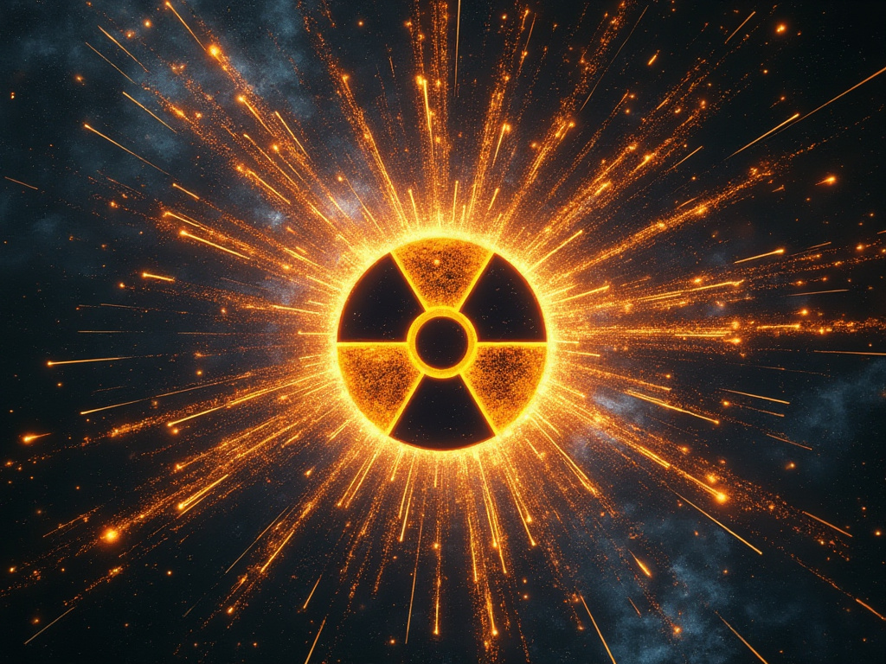
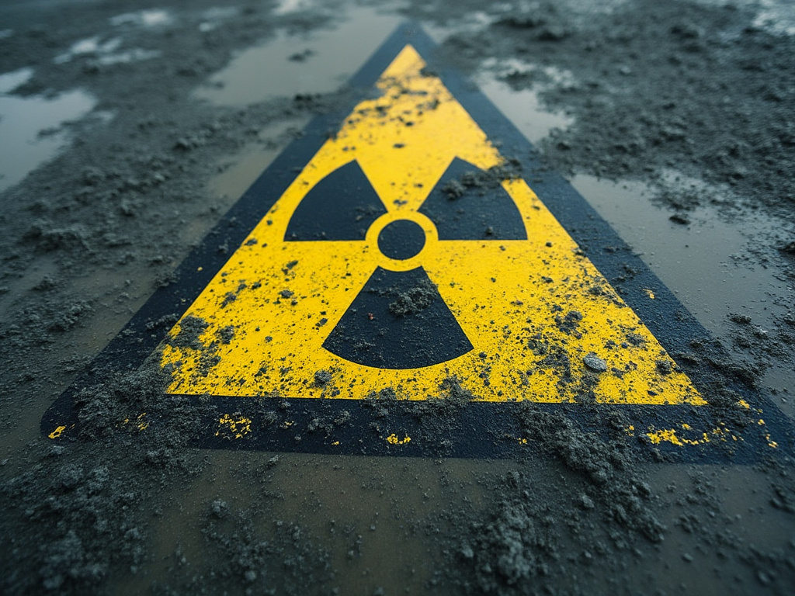
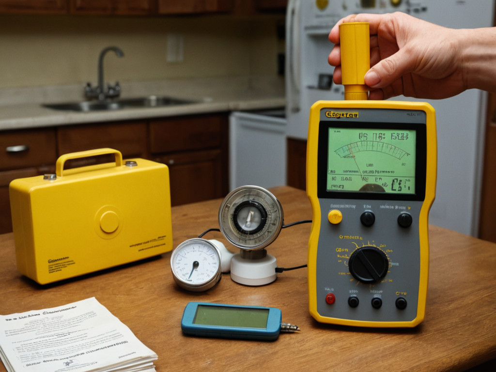

# The ionizing radiation field guide

© 2024 Gissio

Are you thinking about buying a Geiger counter or a scintillation detector, or maybe you've already got one and want to make the most of it? In this brief guide we'll give you a glimpse of how to operate these fascinating devices.

## What do Geiger counters/scintillation detectors measure?

Geiger counters and scintillation detectors are instruments capable of detecting and measuring **ionizing radiation**, which consist of subatomic particles that carry enough energy to remove electrons from atoms, thus ionizing them. This radiation is particularly hazardous to biological tissue, as it can disrupt chemical bonds, damage DNA, cause cellular damage and produce free radicals which in turn can cause further damage.

## What is a radioactive substance?

A radioactive substance is any material with unstable atoms that spontaneously disintegrate, releasing ionizing radiation.

Examples of such materials include uranium glass, uranium-glazed ceramics, naturally occurring potassium, and isotopes like Iodine-131 used in medical treatment.

## What is radioactive contamination?

Radioactive contamination occurs when radioactive substances spread to places where they are neither intended nor desired.

This contamination can be divided into two types:

* **External contamination**, where radioactive substances settle on external surfaces like skin, clothing, or other objects.
* **Internal contamination**, where radioactive substances enter the body through inhalation, ingestion, or absorption through open wounds, posing a significant danger due to the close-range interaction with biological tissue.

Decontamination is the process of removing these radioactive particles from external surfaces. By simply removing clothing and shoes, one can eliminate about 90% of external contamination. A gentle wash with soap and water further removes radiation particles from the skin, preventing the spread of radioactive substances and reducing the risk of internal contamination.

For internal contamination, specific treatments are used. If contaminated with Iodine-131, one might take potassium iodide to saturate the thyroid, thus blocking the uptake of the radioactive iodine. For contamination with Cesium-137, Prussian blue can be administered to bind with the radioactive particles, which then exit the body through natural means.

## What types of ionizing radiation are there?

The most common types of ionizing radiation are:

* **Gamma rays (γ):** These are high-energy photons emitted during nuclear decay. They are highly penetrating and require substantial shielding, such as several centimeters of lead or meters of concrete.
* **X-rays:** Similar to gamma rays but of lower energy, X-rays are less penetrating but  still require shielding.
* **Beta particles (β):** These are fast-moving electrons or positrons. They are less penetrating than gamma rays and can be stopped by a few millimeters of aluminum or several meters of air.
* **Alpha particles (α):** Composed of helium nuclei (two protons and two neutrons), alpha particles have low penetration but high energy. They can be blocked by just a few centimeters of air, a sheet of paper, or the outer layer of the human skin.
* **Neutrons (n):** These pose a unique danger as they can induce radioactivity upon interaction. Effective shielding for neutrons involves hydrogen-rich materials like water or plastic.

Each type of radiation is associated with specific energy levels, typically measured in electronvolts (eV):

* Gamma rays: From 100 keV to 8 MeV.
* X-rays: From 100 eV to 100 keV.
* Beta particles: From a few keV to tens of MeV.
* Alpha particles: Typically 3 to 7 MeV.
* Neutrons: Can vary from less than 1 eV for slow neutrons to over 1 MeV for fast neutrons.

Generally, particles with higher energy cause more damage.

## How is ionizing radiation measured?

Ionizing radiation is measured using several metrics:

### Absorbed dose and rate

Absorbed dose refers to the amount of energy deposited by ionizing radiation per unit mass of any material. It is measured in grays (Gy) in the SI system, where 1 gray equals 1 joule of energy absorbed per kilogram of matter. In older units, it's measured in rads, where 1 rad equals 0.01 gray.

Absorbed rate is absorbed dose per unit of time.

This measurement quantifies the **physical impact** of radiation but does not directly account for the biological effects, which depend on the type of radiation.

### Equivalent dose and rate

Equivalent dose is a measure that reflects the **biological damage** to human tissue from exposure to ionizing radiation. It takes into account not only the absorbed dose (energy deposited per unit mass) but also the biological effectiveness (WR) of the radiation type. It's measured in sieverts (Sv) in the SI system, where 1 sievert equals the amount of radiation that would have the same biological effect as 1 gray of gamma rays or X-rays. In older units, it's measured in rems, where 1 rem equals 0.01 sievert.

Equivalent rate is equivalent dose per unit of time.

This measurement allows for a more accurate assessment of radiation risk to biological tissues.

### How dangerous is ionizing radiation?

Ionizing radiation can be harmful in a way that's largely analogous to how UV radiation from the sun causes sunburns, but with effects that are more severe and can occur internally.

Here's a brief breakdown of doses considered safe:

* **Natural background radiation:** The natural background radiation is on average 2.4 mSv per year. Divided over 365 days and 24 hours, this gives an average hourly rate of about 2.74 μSv/h.

* **Public exposure limits:** The International Commission on Radiological Protection (ICRP) suggests an annual effective dose limit for the general public of 1 mSv, in addition to natural background radiation.

* **Occupational exposure limits:** For workers in fields involving radiation exposure (like nuclear power or medical imaging), the ICRP recommends an average of 20 mSv per year over 5 years, with no single year exceeding 50 mSv.

Here's how higher radiation doses can affect health:

* **Low dose (<100 mSv):** This is somewhat akin to a mild sunburn. Effects might not be immediately visible; cells can repair most of the damage. However, there's an increased risk of cancer over time, much like frequent mild sunburns might lead to skin cancer.

* **Moderate dose (100-1000 mSv):** Similar to a moderate to severe sunburn, this dose might lead to temporary changes in blood chemistry. Symptoms could include nausea, with a more pronounced long-term cancer risk. This is comparable to when a severe sunburn causes skin peeling, swelling, and pain.

* **High dose (1-5 Sv):** Analogous to a severe burn, this level can cause acute radiation syndrome (ARS), with symptoms like severe nausea, vomiting, hair loss, and bone marrow damage, weakening the immune system. Survival is possible with medical intervention, but with lasting health effects. This is like dealing with severe, deep burns that require medical treatment.

* **Very high dose (>5 Sv):** This is catastrophic, akin to third-degree burns. Radiation at this level can impair the central nervous system, leading to disorientation, loss of consciousness, and death within days or weeks without immediate medical intervention. The damage is so extensive that it can be fatal or cause severe disfigurement.

This analogy helps in understanding the severity of radiation effects, but it's crucial to remember that ionizing radiation affects the entire body, not just the skin, and its effects can be cumulative and delayed, unlike the immediate feedback from UV radiation exposure.

## How does a Geiger counter work?

A Geiger counter detects ionizing radiation using a gas-filled tube called a Geiger-Müller tube.

Here's a brief overview of how it works:

* **Radiation interaction:** When ionizing radiation (like alpha, beta, or gamma rays) enters the tube, it ionizes some of the gas atoms inside, creating ion pairs (ions and electrons).

* **Amplification:** The tube has a high voltage applied across it. The electrons from the ion pairs are accelerated towards the anode (positive electrode), gaining enough energy to ionize more gas atoms in a chain reaction, which amplifies the initial ionization event.

* **Pulse generation:** This avalanche of ions results in a sudden surge of electrical current, creating a detectable electrical pulse. Each pulse corresponds to a single ionizing event.

* **Counting:** The pulses are counted by electronic circuits, often converting the count into an audible click or visual display, giving an indication of radiation levels. The number of clicks or counts per minute (CPM) reflects the intensity of the radiation.

## How do Geiger counters respond to different types of radiation?

Geiger tubes respond differently to various types of ionizing radiation due to their unique interaction characteristics:

* **Gamma radiation:** Gamma rays, being high-energy photons, can penetrate the walls of a Geiger tube. However, standard Geiger tubes are less efficient at detecting low-energy gamma rays than their high-energy counterparts.

* **Beta radiation:** Beta particles can enter the Geiger tube if its walls are thin enough. The detection depends on the energy of the beta particles; low-energy betas might not penetrate the walls, whereas high-energy ones will.

* **Alpha radiation:** Most Geiger tubes cannot detect alpha particles because these particles cannot pass through the tube's walls. However, "Pancake" Geiger tubes, equipped with a very thin window made of mica or thin metal, can detect alpha particles, but only if the source is very close due to their limited range.

* **Neutron radiation:** Standard Geiger tubes are not directly sensitive to neutrons since neutrons, being uncharged, don't ionize gas directly. Specialized tubes exist that convert neutrons into detectable particles.

Converting a Geiger counter's counts into an equivalent dose requires multiplying the raw counts by a conversion factor. This factor depends on the Geiger tube's design, the type of radiation (alpha, beta, gamma, neutron), the energy of the radiation particles, and the radiation's intensity.

Manufacturers typically provide a conversion factor under standard conditions, and it can be further calibrated using a known radioactive source.

## What is an energy-compensated Geiger tube?

An energy-compensated Geiger tube is a type of Geiger-Müller counter designed to measure radiation more accurately across different energy levels of ionizing radiation. It includes additional materials or structures, like filters or windows, that adjust the response of the tube so that it detects radiation with a sensitivity that is more uniform across various energies. This compensation helps to ensure that the readings are not disproportionately influenced by either low-energy or high-energy particles, providing a more accurate measure of total radiation exposure.

## What is a scintillation detector?

A scintillation detector is a type of radiation detector that uses a material, known as a scintillator, which emits light (scintillates) when struck by ionizing radiation. This light is then converted into an electrical signal by a photomultiplier tube or a photodiode. The key components include:

* **Scintillator material:** This can be organic (like plastics) or inorganic (like sodium iodide doped with thallium, NaI(Tl)). The choice of material depends on the type of radiation to detect (alpha, beta, gamma, or neutrons) and the energy range.

* **Photodetector:** Converts the light photons into an electrical signal. Photomultiplier tubes (PMTs) are commonly used for their high sensitivity, but photodiodes are also used, especially where space or power consumption is a concern.

* **Signal Processing:** The electrical signal is then amplified, shaped, and can be analyzed to determine the energy, type, and intensity of the radiation.

Scintillation detectors are valued for their fast response times and the capacity to determine the energy levels (also known as spectroscopy), which allows to identify the source of radiation.

## Applications of Geiger counters/scintillation detectors

### Mineral exploration

Geologists use Geiger counters to detect uranium, thorium, and other radioactive minerals, aiding in the mapping of geological structures.

Although Uranium-238, the most common uranium isotope, decays into Thorium-234 via alpha emission (which is typically not detectable by standard Geiger counters unless they have a mica window), the decay chain continues, with subsequent daughter products emitting detectable beta radiation.

Likewise, Thorium-232, the primary isotope of thorium, undergoes a decay sequence that results in the emission of detectable beta radiation from its daughter products.

### Radiation monitoring

Geiger counters are essential for monitoring radiation levels in areas affected by nuclear accidents or at sites of radioactive waste disposal. They help in assessing contamination levels in soil, water, and air.

The most prevalent isotopes released during nuclear accidents are:

* **Iodine-131:** With a half-life of approximately 8 days, this isotope is particularly hazardous due to its uptake by the thyroid gland, which can lead to thyroid cancer with significant exposure. It was notably released during the Chernobyl and Fukushima disasters.

* **Cesium-137:** Its half-life is around 30 years, making it a significant long-term environmental pollutant. Cesium-137 contaminates soil and water, leading to prolonged radiation exposure. It played a critical role in both the Chernobyl and Fukushima incidents.

* **Strontium-90:** This isotope, with a half-life of about 29 years, has a tendency to accumulate in bones, where it mimics calcium. It was significantly released during the Chernobyl disaster and remains a concern in other nuclear events.

These isotopes emit beta and gamma radiation, which can be detected by standard Geiger counters.

Due to their biological effects, persistence in the environment, and the volume released during nuclear accidents, these isotopes are primary concerns. Additionally, other isotopes like carbon-14, tritium (hydrogen-3), and various plutonium isotopes can also be released, though they are either less common or pose less immediate danger in the context of nuclear accidents.

### Food safety

Countries use Geiger counters to screen imported food items for isotopes, especially from regions with known nuclear incidents or high background radiation levels. This ensures that imported foods do not exceed safe radiation levels.

### Radiation therapy oversight

In healthcare settings, Geiger counters are used to monitor for radiation leaks from equipment such as X-ray machines and radiotherapy units, ensuring the safety of both patients and staff.

In the field of radiation therapy, several isotopes are employed for both diagnostic and therapeutic applications:

* **Iodine-131:** Primarily used for treating thyroid cancer. It is administered orally and is absorbed by thyroid cells, including cancer cells, where it emits beta particles to destroy them.

* **Iodine-125:** Used in brachytherapy, especially for prostate cancer, where tiny "seeds" containing the isotope are implanted directly into the tumor to deliver radiation over time.

* **Cobalt-60:** Traditionally used in teletherapy for external beam radiation therapy, though its use has declined with the rise of linear accelerators. It can still be used for certain treatments due to its gamma ray emissions.

* **Iridium-192:** Another isotope used in brachytherapy, particularly in high-dose-rate (HDR) treatments where the source is temporarily placed within the body to treat cancers like those of the cervix, breast, and prostate.

* **Cesium-137:** Has been used in brachytherapy for gynecologic treatments, though less commonly now due to availability issues.

* **Yttrium-90:** Utilized in targeted therapies like selective internal radiation therapy (SIRT) for liver tumors and in radioimmunotherapy for certain lymphomas.

* **Radium-223:** Specifically used for the treatment of bone metastases from prostate cancer. It targets bone tissue, sparing surrounding healthy tissues due to its alpha particle emissions.

* **Lutetium-177:** Increasingly used in peptide receptor radionuclide therapy (PRRT) for neuroendocrine tumors, where it is linked to peptides that target tumor cells.

These isotopes emit beta and gamma radiation, which can be detected by standard Geiger counters.

Each isotope is chosen for its unique characteristics that allow for targeted radiation delivery to cancer cells while minimizing impact on surrounding healthy tissue.

### SHTF (shit hits the fan)

In the aftermath of a nuclear incident, Geiger counters become essential survival tools. They help individuals safely navigate through contaminated landscapes by pinpointing safe zones and steering clear of areas with high radiation levels. Additionally, these devices are crucial for testing food and water supplies for radioactive contamination.

## Experiments

**WARNING:** The authors of Rad Pro are not responsible or liable for any claims, damages, losses, expenses, costs, or liabilities whatsoever resulting or arising directly or indirectly from performing these experiments.

### Background radiation mapping

* **Objective:** Measure natural background radiation levels in different locations.

* **Method:** Use the Geiger counter to take readings in various environments (indoors, outdoors, at different altitudes, near geological formations, etc.). Compare these readings to understand how background radiation varies.

### Radiation from household items

* **Objective:** Identify items in your home that emit radiation.

* **Method:** Measure radiation from items like smoke detectors (which contain small amounts of Americium-241), old watches with radium dials, ceramic pottery with uranium glaze, or Brazilian granite countertops. Document the radiation levels and compare them to background levels to see if they're significantly above normal.

* **WARNING:** To prevent internal contamination, always wear gloves when handling radioactive objects such as uranium rocks. Also, store these objects in sealed plastic bags to reduce the risk of external contamination.

### Radiation shielding experiment

* **Objective:** Understand how different materials shield against radiation.

* **Method:** Place a known radioactive source (like a small piece of uranium ore or a radioactive check source) beside the Geiger counter. Measure the count rate. Then, introduce various materials (lead, aluminum, paper, wood, water) between the source and the counter, noting the reduction in counts for each material.

* **WARNING:** To prevent internal contamination, always wear gloves when handling radioactive objects such as uranium rocks. Also, store these objects in sealed plastic bags to reduce the risk of external contamination.

### Experiment with distance (inverse square law)

* **Objective:** Demonstrate how radiation decreases with distance from the source.

* **Method:** Place a radioactive source at a fixed position and take measurements at increasing distances from the source. Plot the count rate vs. distance to verify the inverse square law of radiation.

* **WARNING:** To prevent internal contamination, always wear gloves when handling radioactive objects such as uranium rocks. Also, store these objects in sealed plastic bags to reduce the risk of external contamination.

### Altitude effects on radiation

* **Objective:** Study how background radiation changes with altitude.

* **Method:** If possible, take the Geiger counter on a trip up a mountain, in an airplane, or use a weather balloon. Record the radiation levels at different altitudes to see the increase in background radiation exposure.

### Radon gas detection

* **Objective:** Measure radon levels in homes or buildings.

* **Method:** Use the Geiger counter in areas where radon might accumulate (like basements). Note that this might require a specialized radon detector, but you can start by checking general radiation levels.
