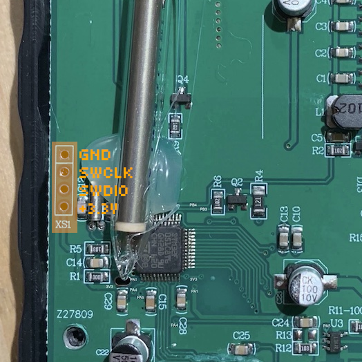
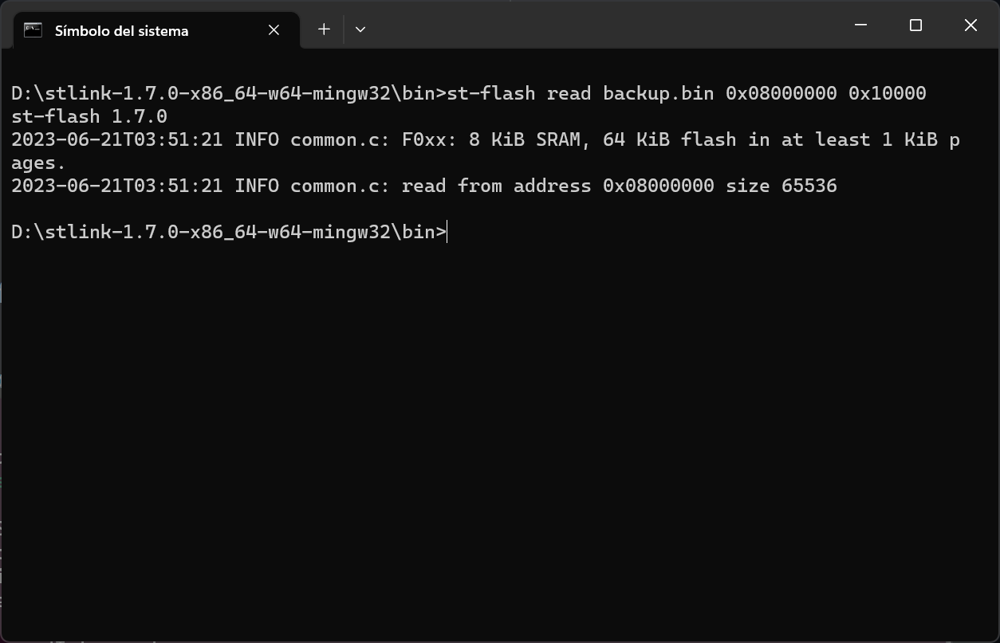
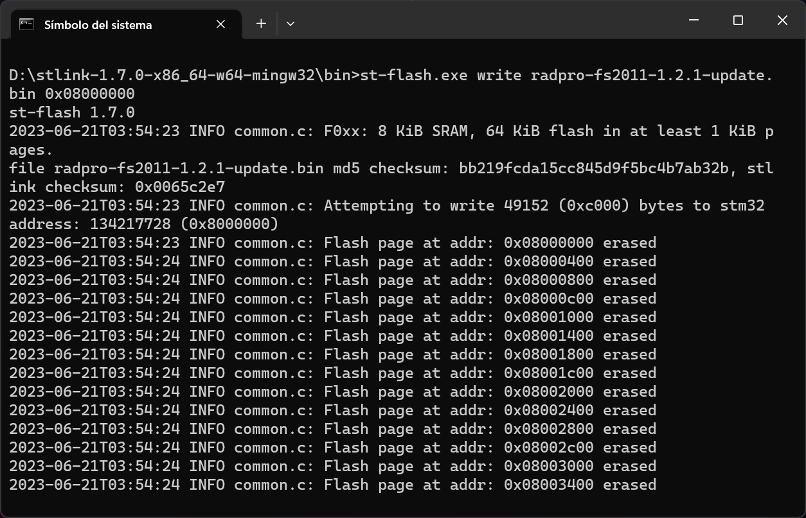

# Installing Rad Pro on the FS2011/FS9000/NR-950/YT-203B

## Supplies

To install Rad Pro on your FS2011/FS9000/NR-950/YT-203B radiation meter/Geiger counter, you will need the following tools and components:

* An [ST-Link V2 USB dongle (or clone)](https://www.amazon.com/s?k=st-link+v2)
* A soldering iron and solder
* A 4-pin header
* A Philips screwdriver
* The [stlink](https://github.com/stlink-org/stlink/releases) software (download the latest release for your operating system)

# Step 1: Open the device

Follow these steps to start installing Rad Pro:

* Remove the battery cover and batteries.
* Remove the four screws holding the back case.
* Remove the four screws holding the electronics board on the front case.
* Remove the electronics board.

The board should look like in the photo above. If it does not, you may have a different hardware revision. In this case, Rad Pro may not function properly.

If your board looks different and Rad Pro does not work, create an issue on https://github.com/Gissio/radpro/issues.

## Step 2: Connect the programmer

Now, follow these steps:

* Solder the 4-pin header to XS1 on the board.
* Make sure there are no batteries in the battery holder.
* Connect the ST-Link V2 device to XS1. The pins, from top to bottom, are:
  * GND
  * SWCLK
  * SWDIO
  * +3.3V

Make sure the electrical connections are correct. You may break your device if the connections are not correct.

## Step 3: Back up the original firmware

Before installing for the first time, back up the original firmware. If you skip this step, you won't be able to restore your device if something goes wrong, so it is important you do it right.

To create a backup, open a terminal and go to the bin folder within the stlink folder.

Then, copy+paste the following command and verify that the resulting file, backup.bin, has a size of 65536 bytes:

    st-flash read backup.bin 0x08000000 0x10000

## Step 4: Flash the firmware

Now, download the latest firmware from the [Rad Pro releases](https://github.com/Gissio/radpro/releases): get radpro-fs2011-x.y.z-install.bin when installing for the first time or radpro-fs2011-x.y.z-update.bin when updating.

Next, run this command in the terminal:

    st-flash write [firmware-filename] 0x08000000

## Step 5: Optional mods

* For easier access to XS1, use a file to extend the hole for the battery holder clip so that a 4-pin header connector can fit. Solder four cables approximately 15 cm long between XS1 and a 4-pin header. Using a glue gun, attach the header to the inside of the back case, so you can access the header with the battery case open.
* For improved measurement, align the Geiger-Müller tube to the holes of the back case using a heat gun/glue gun if the tube is mounted vertically. Be careful, as the tube's glass is very delicate.
* Some AA rechargeable batteries have low-profile caps that don't make electrical contact with the battery holder. To fix this problem, apply solder on the battery holder's pads.
* To increase the buzzer's volume, drill a hole on the back case in front of the buzzer.
* The device is able to charge Ni-MH batteries if you add a female USB port and connect its GND and +5V port to the 0V and 5V pad of the electronics board.

## Step 6: Star the project

If you like Rad Pro, [star the project](https://github.com/Gissio/radpro).
