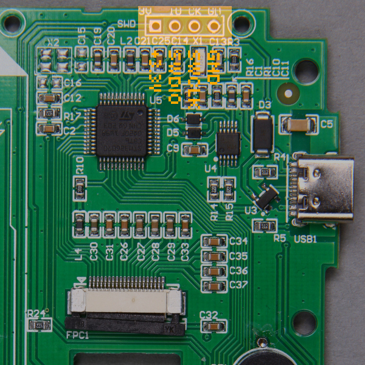

# Installing on the Bosean FS-600

## Supplies

To install Rad Pro on your Bosean FS-600 or FS-1000 Geiger counter, you will need the following tools and components:

* An [ST-Link V2 USB dongle (or clone)](https://www.amazon.com/s?k=st-link+v2)
* A soldering iron and solder
* A 4-pin header
* A Philips screwdriver
* The [stlink](https://github.com/stlink-org/stlink/releases) software (download the latest release for your operating system)
* If you use Windows, the [ST-LINK driver](https://www.st.com/en/development-tools/stsw-link009.html).

## Step 1: Open the device

Follow these steps to start installing Rad Pro:

* Remove the battery cover and batteries.
* Remove the screws holding the back case.
* Remove the screws holding the electronics board to the front case.
* Remove the electronics board.
* Disconnect the battery connected to BAT1.

The board should look like in the photo above. If it does not, you may have a different hardware revision. In this case, Rad Pro may not function properly.

If your board looks different and Rad Pro does not work, create an issue on https://github.com/Gissio/radpro/issues.

## Step 2: Connect the programmer

Now, follow these steps:

* Solder the 4-pin header to SWD on the board.
* Make sure there are no batteries in the battery holder.
* If you use Windows, install the [ST-LINK driver](https://www.st.com/en/development-tools/stsw-link009.html).
* Connect the ST-Link V2 device to SWD. The pins, from left to right, are:
  * +3.3V
  * SWDIO
  * SWCLK
  * GND

Make sure the electrical connections are correct. You may break your device if the connections are not correct.

## Step 3: Back up the original firmware

Before installing for the first time, back up the original firmware. If you skip this step, you won't be able to restore your device if something goes wrong, so it is important you do it right.

To create a backup, open a terminal and go to the bin folder within the stlink folder.

Then, copy+paste the following command and verify that the resulting file, backup.bin, has a size of 131072 bytes:

    st-flash read backup.bin 0x08000000 0x20000

## Step 4: Flash the firmware

Now, download the latest firmware from the [Rad Pro releases](https://github.com/Gissio/radpro/releases):

* If your device is a Bosean FS-600, get radpro-bosean-fs600-install-x.y.z.bin when installing for the first time or radpro-bosean-fs600-update-x.y.z.bin when updating.
* If your device is a Bosean FS-1000, get radpro-bosean-fs1000-install-x.y.z.bin when installing for the first time or radpro-bosean-fs1000-update-x.y.z.bin when updating.

Next, run this command in the terminal:

    st-flash write [firmware-filename] 0x08000000

## Step 5: Finish up

* Reconnect the battery connector to BAT1.
* Close the device.
* To enable USB data logging under Windows, install the [CH340 driver](https://www.catalog.update.microsoft.com/Search.aspx?q=USB%5CVID_1A86%26PID_7523).

## Step 6: Show your support

If you like Rad Pro, consider showing your support by starring the project on GitHub. Your support is greatly appreciated.
