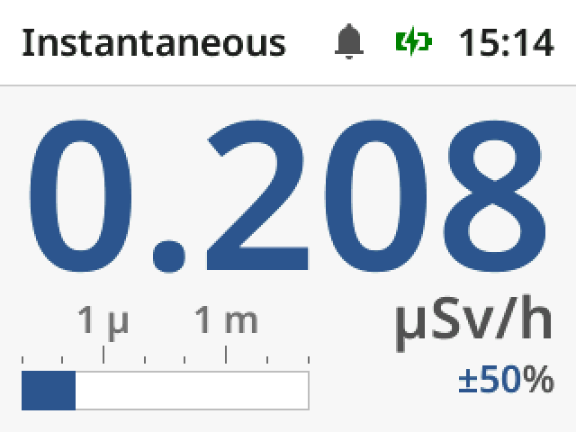
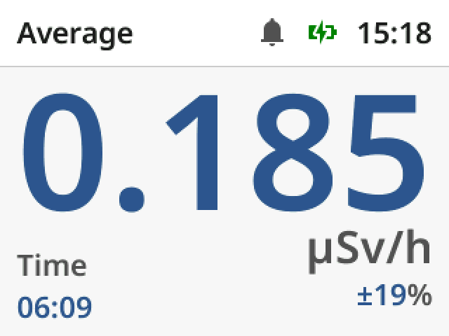
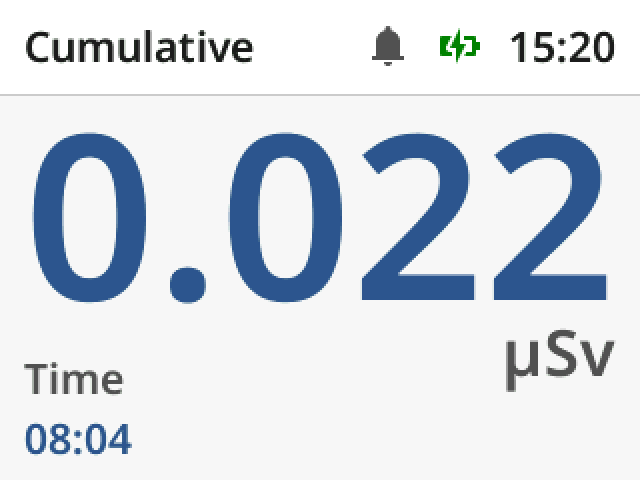
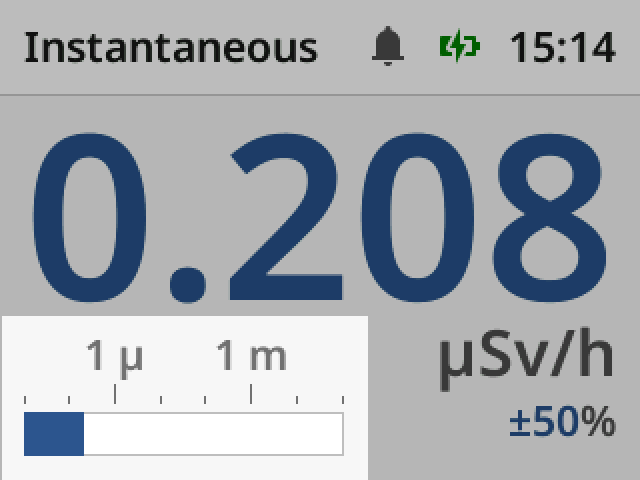
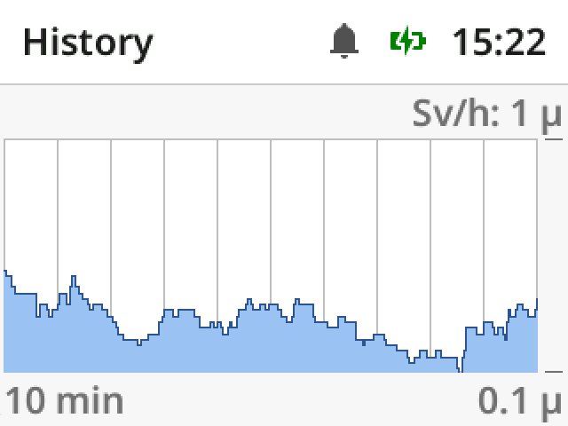
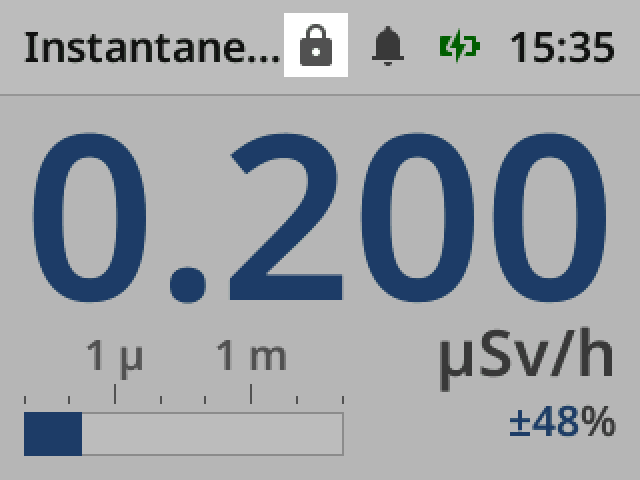
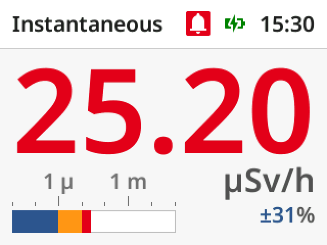
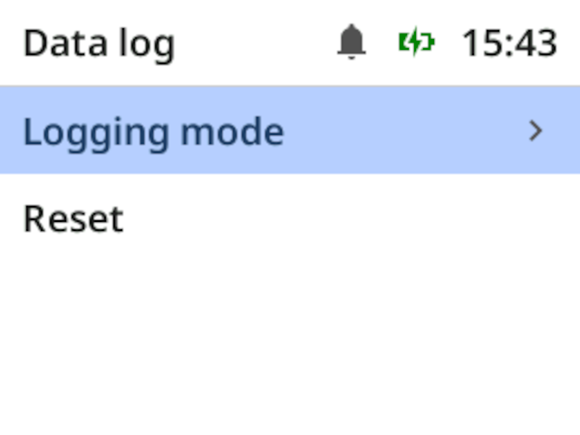
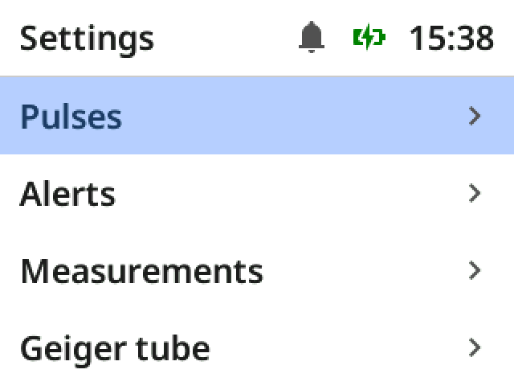
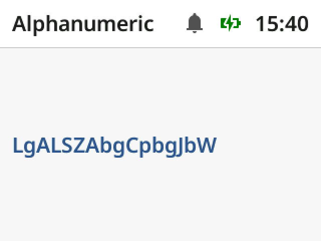

# Rad Pro User's Manual

**Rad Pro** is a custom firmware that enhances the capabilities of supported Geiger counters. It provides advanced measurement tools, data logging, alerting, and visualization features beyond stock firmware.

## 1. Getting Started: What You're Measuring

Before using Rad Pro, it helps to understand what the device is actually telling you.

### 1.1 Instantaneous Rate

The **instantaneous rate** is the current intensity of ionizing radiation detected by the Geiger tube.

* Typically expressed in **µSv/h** or **CPM**
* Based on detected pulses from the Geiger tube
* Shown as a continuously updated estimate

Because radiation is random, instantaneous readings may fluctuate significantly.

Fast-changing numbers do not necessarily indicate changing radiation levels—they often reflect statistical noise.

### 1.2 Average Rate

Rad Pro improves measurement reliability by averaging measurements over time.

* **Short averaging** → faster response, more noise
* **Long averaging** → slower response, more stable results

Each reading includes a **confidence interval**, indicating its precision.

> **Key idea:** A stable reading requires both time and enough detected counts.

In low-radiation environments, stability takes longer to achieve.

In practice:

* Use the instantaneous rate to detect changes
* Use the average rate to assess actual levels

### 1.3 Cumulative Dose

While the instantaneous rate tells you "how intense right now", the dose tells you "how much over time".

* Continuously accumulated during operation
* Stored periodically to prevent data loss
* Useful for tracking total exposure

## 2. Using the Device

### 2.1 The Main Screen

The main screen is your primary workspace. It provides:

* Instantaneous rate
* Average rate
* Cumulative dose
* History
* Electric and magnetic field strength (if supported)

**Note:** To reset the average rate and cumulative dose, refer to the device installation instructions.

### 2.2 Visual Bar

The visual bar on the instantaneous rate screen represents radiation levels on a logarithmic scale.

* Each step corresponds to a **10× increase**
* Designed to make both low and high levels readable

This allows you to quickly recognize significant changes without focusing on exact values.

### 2.3 History Screen

Rad Pro records and visualizes measurements over multiple time scales:

* 10 minutes
* 1 hour
* 1 day
* 1 week
* 1 month
* 1 year

These views help you:

* Identify trends
* Detect anomalies
* Understand long-term exposure patterns

Like the visual bar, history plots use a **logarithmic scale**.

### 2.4 Lock Mode

Lock mode prevents accidental input while the device is being carried or handled.

* Disables configuration controls
* Keeps measurement screens accessible
* Requires a key combination to unlock

**Note:** To enter lock mode, refer to the device installation instructions.

## 3. Alerts

Rad Pro can notify you when radiation levels exceed defined thresholds.

### 3.1 Alert Types

* **Warning** — early indication
* **Alarm** — critical threshold exceeded

### 3.2 Alert Signals

Alerts may use:

* Sound
* Vibration
* LED indication
* Display flashing

### 3.3 Behavior

* Alerts remain active until acknowledged
* Acknowledging does **not** clear the condition
* Visual indicators remain active while thresholds are exceeded

## 4. Data Logging

### 4.1 Storage

Measurements can be logged to:

* Internal flash memory
* External systems via USB

### 4.2 What Gets Recorded

Each record includes:

* Timestamp
* Cumulative dose

### 4.3 Export

Data can be:

* Exported via USB
* Processed using external tools
* Uploaded to online services

## 5. Configuration

Rad Pro is highly configurable to match your use case.

### 5.1 Measurement Settings

You can configure:

* Averaging intervals
* Tube sensitivity (calibration)
* Units (µSv/h, CPM, etc.)

### 5.2 Alerts

* Threshold values
* Alert types and signals

### 5.3 Device Settings

* Time and timezone
* Display behavior
* Power management

## 6. Random Generator

Rad Pro includes a true random number generator based on physical radiation events.

Available outputs:

* Numbers (decimal, hexadecimal, binary)
* Passwords (ASCII / alphanumeric)
* Dice rolls
* Coin flips

**Note:** To restart the number generator, refer to the device installation instructions.

## 7. Best Practices

For reliable measurements:

* Ensure the proper Geiger tube is selected
* Allow time for readings to stabilize
* Prefer averaged readings for decision-making
* Use instantaneous readings to detect changes

## 8. Limitations

Keep in mind:

* Instantaneous readings are inherently noisy
* Low radiation environments require longer averaging
* Accuracy depends on correct calibration
* Some features depend on hardware capabilities

## 9. Troubleshooting

**The clock resets every time the device is turned on**
→ Replace the CR1220 backup battery (FNIRSI GC-01).

**The splash screen lasts up to 60 seconds**
→ Replace the CR1220 backup battery (FNIRSI GC-01).

**Pulses are not indicated**
→ Disable Settings > Pulses > Threshold.

## 10. Further Resources

* [Installation guides](../README.md#supported-devices) – For supported devices
* [Rad Pro reference manual](reference-manual.md) – Technical reference for Rad Pro
* [Ionizing radiation field guide](https://github.com/Gissio/ionizing-radiation-field-guide) – Learn about ionizing radiation
